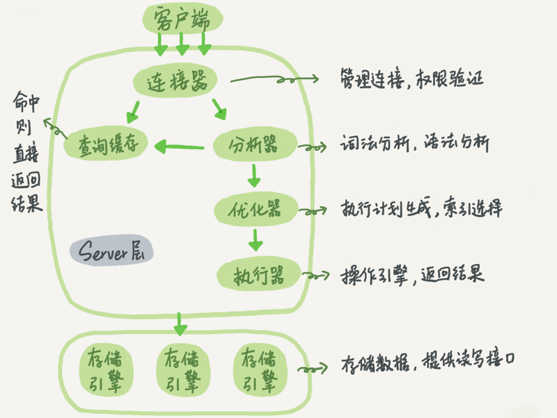
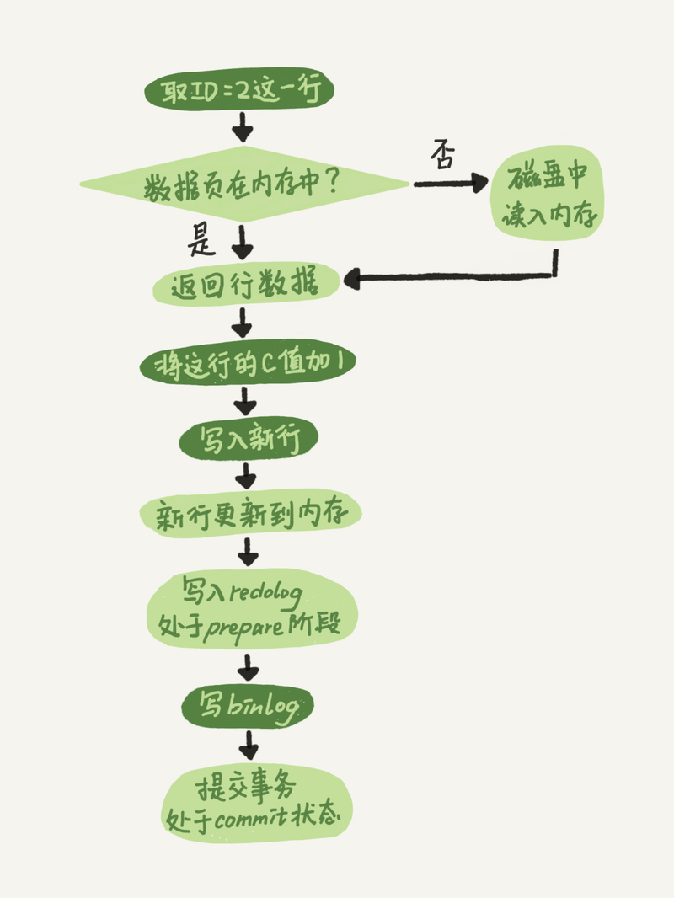

# mysql为性能做了哪些努力



## 查询性能

### server层的努力

#### 查询缓存

查询缓存的失效非常频繁，只要有对一个表的更新，这个表上所有的查询缓存都会被清空。因此很可能你费劲地把结果存起来，还没使用呢，就被一个更新全清空了。对于更新压力大的数据库来说，查询缓存的命中率会非常低。除非你的业务就是有一张静态表，很长时间才会更新一次。比如，一个系统配置表，那这张表上的查询才适合使用查询缓存。所以，MySQL 8.0版本直接将查询缓存的整块功能删掉了。

#### 优化器

优化器会制定查询计划然后交给存储引擎去实施。
比如你执行下面这样的语句，这个语句是执行两个表的join：

```sql
mysql> select * from t1 join t2 using(ID)  where t1.c=10 and t2.d=20;
```

- 既可以先从表t1里面取出c=10的记录的ID值，再根据ID值关联到表t2，再判断t2里面d的值是否等于20。
- 也可以先从表t2里面取出d=20的记录的ID值，再根据ID值关联到t1，再判断t1里面c的值是否等于10。

这两种执行方法的逻辑结果是一样的，但是执行的效率会有不同，而优化器的作用就是决定选择使用哪一个方案。
> 这个过程简单理解就是：计算不同查询计划的成本，最后**选择一个成本最少的查询计划**。

### 引擎层的努力（innodb）

#### 日志系统

mysql通过redo log和bin log的配合实现了数据库系统的崩溃恢复机制和数据找回。

在更新语句执行的时候，如果每一次的更新操作都需要写进磁盘，然后磁盘也要找到对应的那条记录，然后再更新，整个过程IO成本、查找成本都很高。所以，**innodb使用了WAL技术**，WAL技术的全称是Write-Ahead Logging，它的关键点就是先写日志，再写磁盘。避免了每次更新操作都立即写进磁盘。更新步骤如下图所示：



> WAL技术的简单理解就是：为了避免每次执行更新都进行耗时的更新磁盘操作，先把内存中的记录进行跟新并记入日志，等到有空闲时间再把内存中的记录刷新到磁盘。

#### 索引结构

innodb选择b+树作为索引的数据结构的原因很多，这里只从查询效率的角度进行分析。  

b+数作为索引结构时，非叶子节点保存的是记录的主键，叶子节点保存的是完整记录。每一个节点的大小是16kb称之为页