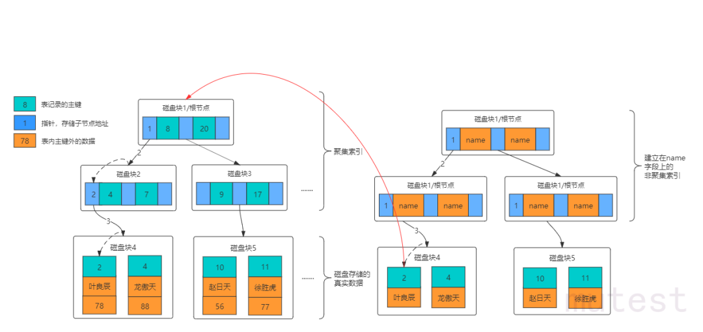
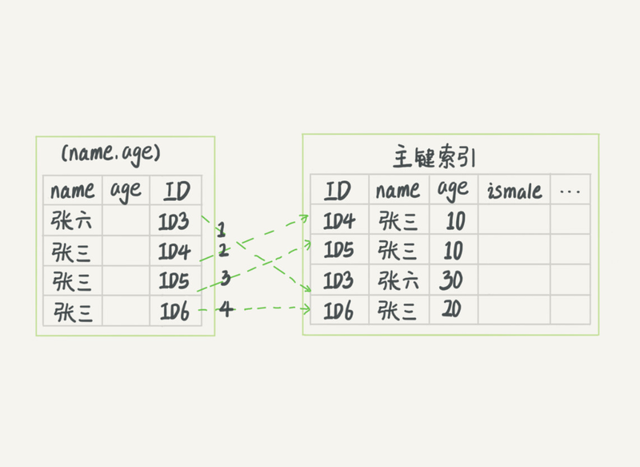
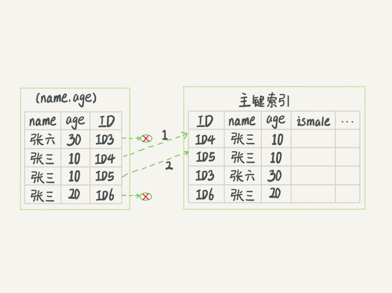

# <center> Mysql为性能做了哪些努力 <center/>

> Mysql45讲（课程），Mysql是怎样运行的（书），CMU 15-445: Database Systems（课程）
## 覆盖索引



非聚簇索引与聚簇索引主要有两点不同：1.叶子节点2.需要回表，在使用联合索引的时候，如果查询的字段是联合索引的子集那么将不用回表。

### 实验

创建表格

```sql
creat table t1 {
    a INT NOT NULL PRIMARY KEY,
    b INT,
    c INT, 
    d INT,
    INDEX idx_bc (b, c)
}
```

调用存储过程

```sql
DELIMITER //

CREATE PROCEDURE insertRecordsIntoT1()
BEGIN
    DECLARE i INT DEFAULT 1;
    WHILE i <= 300 DO
        INSERT INTO t1 (a, b, c, d) VALUES (i, i, i, i);
        SET i = i + 1;
    END WHILE;
END //

DELIMITER ;
```

执行查询

```sql

explain select b,c from t1 where b = 10;//1
explain select b,c,d from t1 where b = 10;//2

```

结果

|id|select_type|table|type|possible_keys|key|ref|rows|Extra|
|-|-|-|-|-|-|-|-|-|
|1|SIMPLE|t1|ref|idx_bc|idx_bc|const|1|Using index|
|2|SIMPLE|t1|ref|idx_bc|idx_bc|const|1||

> 实践：建立包含了查询字段和过滤条件的联合索引可以加快速度。也就是说：如果**联合索引包含了查询字段和过滤条件**就可以避免回表。

## 索引下推

可以将where判断提前到非聚簇索引上以减少回表次数。  


### 实验

执行查询

```sql
explain select * from t1 where b > 290 and c < 295;//1
explain select * from t1 where b > 290 and d < 295;//2
```

查询结果

|id|select_type|table|type|possible_keys|key|ref|rows|Extra|
|-|-|-|-|-|-|-|-|-|
|1|SIMPLE|t1|range|idx_bc|idx_bc||10|Using index condition|
|2|SIMPLE|t1|range|idx_bc|idx_bc||10|Using index condition; Using where|

> 实践：与覆盖索引类似，将需要的**过滤条件建立联合索引**，可以减少回表次数。

## 普通索引和唯一索引

普通索引和唯一索引在查询性能上差距很小，在**更新性能**上有较大的区别。  
对于唯一索引来说，所有的更新操作都要先判断这个操作是否违反**唯一性约束**。  
而普通索引不需要判断唯一性约束，意味着可以**先将更新放到缓存：change buffer**中，等有查询或者空余时间在真正更新记录。  

### 实验

❌**实验没有复现出来**❌

> 实践：为了更新性能好，我们可以尽量使用普通索引。

## 索引失效

mysql> select * from tuser where email=110717;

即使email上建立了索引，如果email是varchar类型，索引就会失效！。

### 实验

创建表

```sql
CREATE TABLE t4 (
    a INT AUTO_INCREMENT PRIMARY KEY,
    b INT,
    c INT,
    d VARCHAR(255)
);
CREATE INDEX idx_d ON t4(d);

DELIMITER //

CREATE PROCEDURE insertRecordsIntoT4()
BEGIN
    DECLARE i INT DEFAULT 1;
    WHILE i <= 300 DO
        INSERT INTO t4 (b, c, d) VALUES (i, i, i);
        SET i = i + 1;
    END WHILE;
END //

DELIMITER ;

CALL insertRecordsIntoT4();
```

查询

```sql
explain select * from t4 where d = 4;//1
explain select * from t4 where d = '4';//2
```

查询结果
|id|select_type|table|type|possible_keys|key|ref|rows|Extra|
|-|-|-|-|-|-|-|-|-|
|1|SIMPLE|t4|ALL|idx_d|||300|Using where|
|1|SIMPLE|t4|ref|idx_d|idx_d|const|1||

> 实践：避免类型转换、条件字段函数操作，这会使索引失效。

## 行锁

模拟一个场景

|事务A|事务B|
|-|-|
|开启事务|开启事务|
|获取行锁 A|等待锁A|
|do something|等待锁A|
||等待锁A|
|结束事务|等待锁A|
||结束事务|

再do something之后可以释放锁的，但实施并不是这样，锁的释放一律是在事务结束之后。

<div STYLE="page-break-after: always;"></div>

### 实验

|事务A|事务B|
|-|-|
|BEGIN;|BEGIN;|
|select * from t1 where a = 10 for update;||
|select * from t1 where a = 1;|update t1 set b=10 where a=10;|
|select * from t1 where a = 2;|等待|
|COMMIT;|更新成功|
||COMMIT;|

> 实践：在开启事务的时候，尽量将需要拿锁的查询放在后面以减少持有锁的时间。

## 随机查询

```sql
explain select a from t4 ORDER BY rand() limit 1;
```

这条sql不仅会全表扫描而且会建立临表排序！非常耗时

### 实验

执行查询

```sql
explain select a from t4 ORDER BY rand() limit 1;
```

查询结果
|id|select_type|table|type|possible_keys|key|ref|rows|Extra|
|-|-|-|-|-|-|-|-|-|
|1|SIMPLE|t4|index|idx_d|idx_d||300|Using index; Using temporary; Using filesort|

> 实践：在后端自己选择(如果可以的话)随机的id去查询。