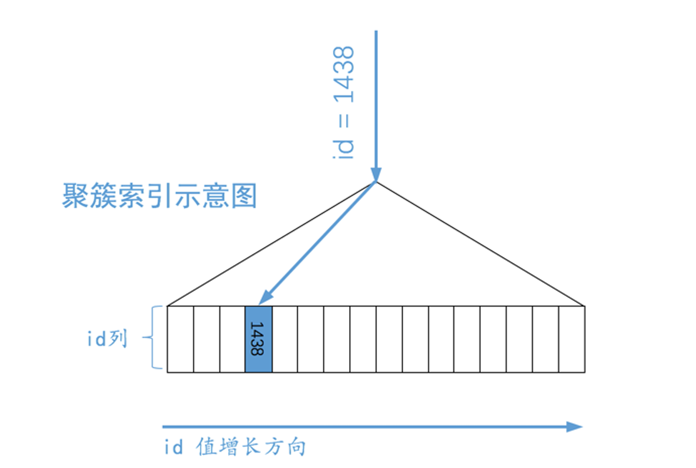
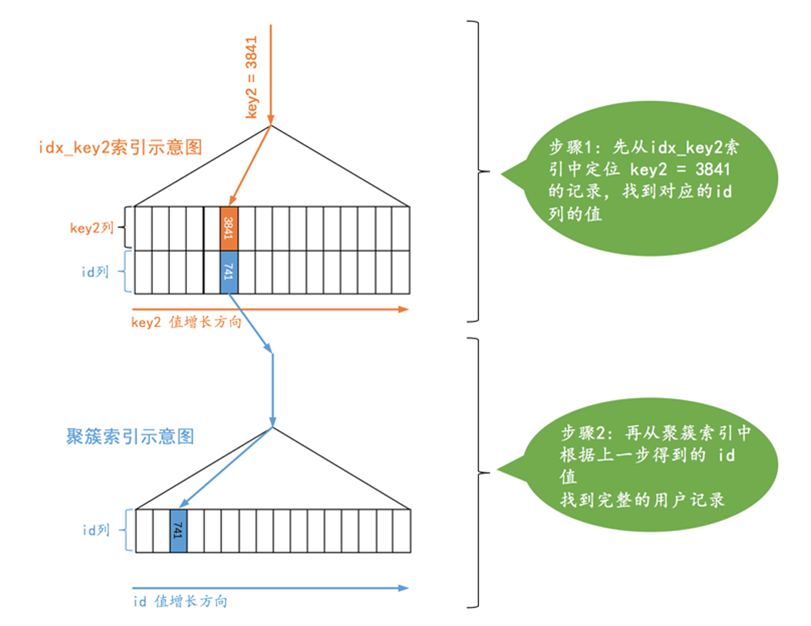
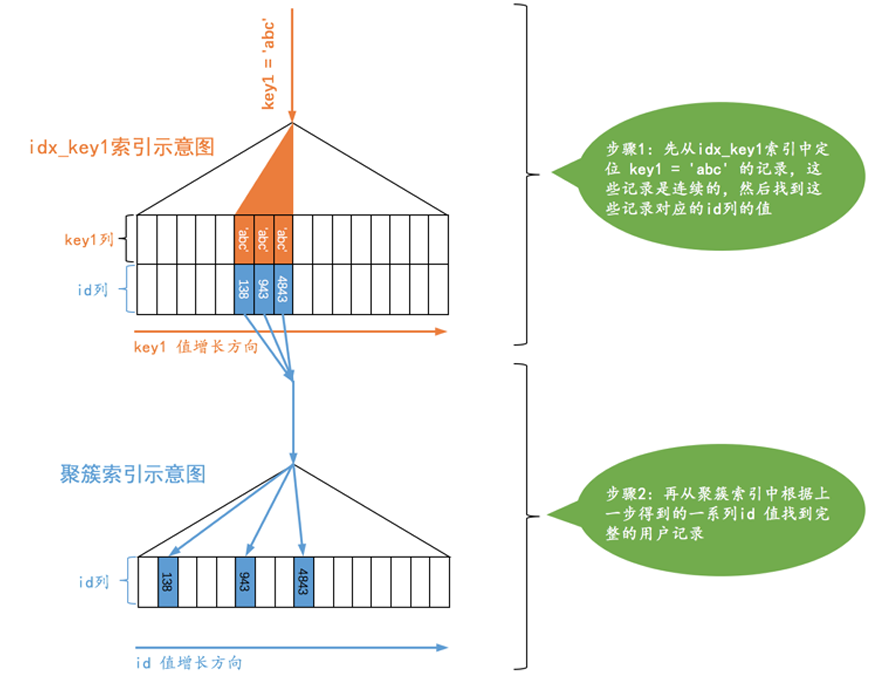
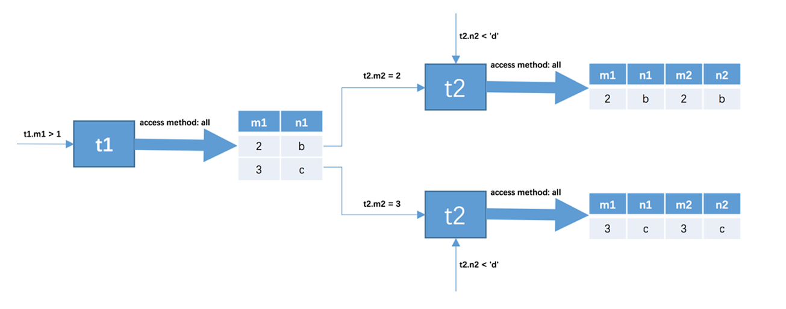
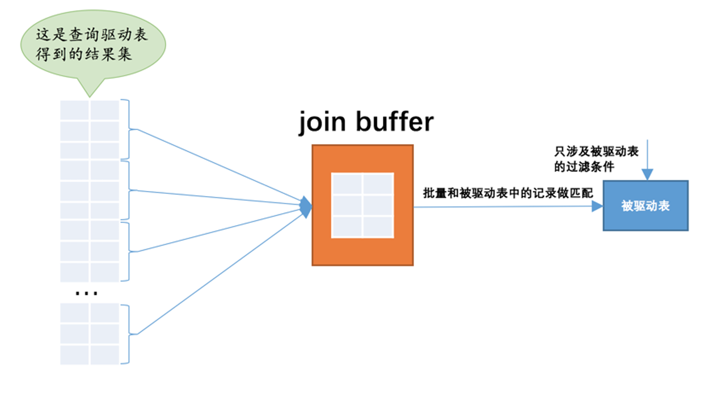

# 单表访问方法

```sql
CREATE TABLE single_table ( 
   id INT NOT NULL AUTO_INCREMENT, 
   key1 VARCHAR(100), 
   key2 INT, 
   key3 VARCHAR(100), 
   key_part1 VARCHAR(100), 
   key_part2 VARCHAR(100), 
   key_part3 VARCHAR(100), 
   common_field VARCHAR(100), 
   PRIMARY KEY (id), 
   KEY idx_key1 (key1), 
   UNIQUE KEY idx_key2 (key2), 
   KEY idx_key3 (key3), 
   KEY idx_key_part(key_part1, key_part2, key_part3) 
) Engine=InnoDB CHARSET=utf8;
```

## const

设计MySQL的大叔认为通过主键或者唯一二级索引列与常数的等值比较来定位一条记录是像坐火箭一样快的，所以他们把这种通过主键或者唯一二级索引列来定位一条记录的访问方法定义为：const，意思是常数级的，代价是可以忽略不计的。


> SELECT * FROM single_table WHERE id = 1438;



> SELECT * FROM single_table WHERE key2 = 3841;

## ref



> SELECT * FROM single_table WHERE key1 = 'abc';

从图示中可以看出，对于普通的二级索引来说，通过索引列进行等值比较后可能匹配到多条连续的记录，而不是像主键或者唯一二级索引那样最多只能匹配1条记录，所以这种ref访问方法比const差了那么一丢丢，但是在二级索引等值比较时匹配的记录数较少时的效率还是很高的（如果匹配的二级索引记录太多那么回表的成本就太大了），跟坐高铁差不多。

## ref_or_null


> SELECT * FROM single_demo WHERE key1 = 'abc' OR key1 IS NULL;

可以看到，上边的查询相当于先分别从idx_key1 索引对应的 B+ 树中找出key1 IS NULL 和 key1 = 'abc' 的两个连续的记录范围，然后根据这些二级索引记录中的id值再回表查找完整的用户记录。

## range

> SELECT * FROM single_table WHERE key2 IN (1438, 6328) OR (key2 >= 38 AND key2 <= 79);

我们当然还可以使用全表扫描的方式来执行这个查询，不过也可以使用二级索引 + 回表的方式执行，如果采用二级索引 + 回表 的方式来执行的话，那么此时的搜索条件就不只是要求索引列与常数的等值匹配了，而是索引列需要匹配某个或某些范围的值。

设计MySQL 的大叔把这种利用索引进行范围匹配的访问方法称之为：range。

## index

> SELECT key_part1, key_part2, key_part3 FROM single_table WHERE key_part2 = 'abc';

由于`key_part2` 并不是联合索引 `idx_key_part` 最左索引列，所以我们无法使用 `ref` 或者 `range` 访问方法来执行个语句。但是这个查询符合下边这两个条件：

- 它的查询列表只有3个列：key_part1 , key_part2 , key_part3 ，而索引 idx_key_part 又包含这三个列。
- 搜索条件中只有key_part2 列。这个列也包含在索引 idx_key_part 中。

也就是说我们可以直接通过遍历idx_key_part 索引的叶子节点的记录来比较 key_part2 = 'abc' 这个条件是否成立，把匹配成功的二级索引记录的key_part1 , key_part2 , key_part3 列的值直接加到结果集中就行了。由于二级索引记录比聚簇索记录小的多（聚簇索引记录要存储所有用户定义的列以及所谓的隐藏列，而二级索引记录只需要存放索引列和主键），而且这个过程也不用进行回表操作，所以直接遍历二级索引比直接遍历聚簇索引的成本要小很多，设计MySQL 的大叔就把这种采用遍历二级索引记录的执行方式称之为：index。

## all

## 注意事项

### 有的搜索条件无法使用索引的情况

```sql
EXPLAIN SELECT * from users where Email > 'd' AND PASSWORD = 'luozhihu123';
```

在这个查询中`Email`有索引，`PASSWORD`没有索引。查询结果如下
|id|select_type|table|partitions|type|possible_keys|key|key_len|ref|rows|filtered|Extra|
|-|-|-|-|-|-|-|-|-|-|-|-|
|1|SIMPLE|users|range|range|Email|Email|1022||9|10.00|Using index condition; Using where|

```sql
EXPLAIN SELECT * from users where Email > 'a' AND PASSWORD = 'luozhihu123';
```

把这个查询条件改一下，他的查询计划就会被改变，结果如下：
|id|select_type|table|partitions|type|possible_keys|key|key_len|ref|rows|filtered|Extra|
|-|-|-|-|-|-|-|-|-|-|-|-|
|1|SIMPLE|users|range|ALL|||||12|10.00|Using where|

显然，查询计划从使用索引变成了全表扫描。

> 优化器根据条件`Email > 'd'`符合的记录条数太决定是否使用索引。  
> 数据库的优化器会根据**统计信息**来评估执行计划的成本。如果统计信息不准确或过时，可能导致优化器做出错误的决策，从而在不同的数据量下选择不同的执行方式。

### 复杂搜索条件下找出范围匹配的区间

```sql
SELECT * FROM single_table WHERE  
       (key1 > 'xyz' AND key2 = 748 ) OR 
       (key1 < 'abc' AND key1 > 'lmn') OR 
       (key1 LIKE '%suf' AND key1 > 'zzz' AND (key2 < 8000 OR common_field = 'abc')) ;
```

在这个查询中`key1`和`key2`有索引，`common_field`没有索引。  
假设优化器使用`key1`作为索引，那么通过以下步骤对条件进行简化，

1. 保持与`key1`相关的条件不变。
2. 将与`key1`无关的条件直接设为`true`。
3. 对查询语句简化。

最后得到的查询条件为：

```sql
SELECT * FROM single_table WHERE key1 > 'xyz';
```

> 也就是说：上边那个有一坨搜索条件的查询语句如果使用 `key1` 索引执行查询的话，需要把满足 `key1 > 'xyz'` 的二级索引记录都取出来，然后拿着这些记录的id再进行回表，得到完整的用户记录之后再使用其他的搜索条件进行过滤。

## 索引合并

###  Intersection合并（交集）

```sql
SELECT * FROM single_table WHERE key1 = 'a' AND key3 = 'b';
```

其中，`key1`和`key3`都有索引。

> **查询计划：**将满足`key1 = 'a'` 和 `key3 = 'b'`的二级索引都查出来，然后取交集，最后去聚簇索引中把记录查出来。

会发生索引合并的必要条件有以下几个
- 查询条件都是二级索引，那么只能是等值查询。
- 只有主键可以是范围查询。

### Union合并（交集）

```sql
SELECT * FROM single_table WHERE key1 = 'a' OR key3 = 'b'
```

其中，`key1`和`key3`都有索引。
> **查询计划：**将满足`key1 = 'a'` 和 `key3 = 'b'`的二级索引都查出来，然后取b并集，最后去聚簇索引中把记录查出来。

MySQL 在某些特定的情况下才可能会使用到Union 索引合并：

- 情况一：二级索引列是等值匹配的情况，对于联合索引来说，在联合索引中的每个列都必须等值匹配，不能出现只出现匹配部分列的情况。
- 主键列可以是范围匹配

### Sort-Union合并

```sql
SELECT * FROM single_table WHERE key1 < 'a' OR key3 > 'z'
```

- 先根据key1 < 'a' 条件从 idx_key1 二级索引总获取记录，并按照记录的主键值进行排序
- 再根据key3 > 'z' 条件从 idx_key3 二级索引总获取记录，并按照记录的主键值进行排序
- 因为上述的两个二级索引主键值都是排好序的，剩下的操作和Union索引合并方式就一样了。

# 连接的原理

## 嵌套循环连接（Nested-Loop Join）

```
for each row in t1 {   #此处表示遍历满足对t1单表查询结果集中的每一条记录 
   for each row in t2 {   #此处表示对于某条t1表的记录来说，遍历满足对t2单表查询结果集中的
每一条记录 
       for each row in t3 {   #此处表示对于某条t1和t2表的记录组合来说，对t3表进行单表查询 
           if row satisfies join conditions, send to client 
       } 
   } 
}
```
这个过程就像是一个嵌套的循环，所以这种驱动表只访问一次，但被驱动表却可能被多次访问，访问次数取决于对驱动表执行单表查询后的结果集中的记录条数的连接执行方式称之为嵌套循环连接（Nested-Loop Join ），这是最简单，也是最笨拙的一种连接查询算法。

## 使用索引加快连接速度

```sql
SELECT * FROM t1, t2 WHERE t1.m1 > 1 AND t1.m1 = t2.m2 AND t2.n2 < 'd';
```

执行过程如下图：



查询驱动表t1后的结果集中有两条记录，嵌套循环连接算法需要对被驱动表查询2次：

- 当t1.m1 = 2 时，去查询一遍 t2 表，对 t2 表的查询语句相当于：

 ```sql
 SELECT * FROM t2 WHERE t2.m2 = 2 AND t2.n2 < 'd';
 ```

- 当t1.m1 = 3 时，再去查询一遍 t2 表，此时对 t2 表的查询语句相当于：

```sql
 SELECT * FROM t2 WHERE t2.m2 = 3 AND t2.n2 < 'd';
 ```

 现在只需要为`t2`表建立索引就可以加速了。

 ## 基于块的嵌套循环连接（Block Nested-Loop Join）

 如果被驱动表太大了，那么就需要对被驱动表多次循环扫描。如果将驱动表加载到缓存，那么被驱动表只需要扫描一次。

 

# MySQL基于成本的优化

在MySQL中一条查询语句的执行成本是由下边这两个方面组成的：
- I/O 成本  
我们的表经常使用的MyISAM 、 InnoDB 存储引擎都是将数据和索引都存储到磁盘上的，当我们想查询表中的记录时，需要先把数据或者索引加载到内存中然后再操作。这个从磁盘到内存这个加载的过程损耗的时间称之为I/O 成本。
- CPU 成本  
读取以及检测记录是否满足对应的搜索条件、对结果集进行排序等这些操作损耗的时间称之为CPU成本。

> InnoDB 存储引擎来说，页是磁盘和内存之间交互的基本单位，设计MySQL 的大叔规定读取一个页面花费的成本默认是1.0 ，读取以及检测一条记录是否符合搜索条件的成本默认是0.2。

## 基于成本的优化步骤

1. 根据搜索条件，找出所有可能使用的索引
2. 计算全表扫描的代价
3. 计算使用不同索引执行查询的代价
4. 对比各种执行方案的代价，找出成本最低的那一个

举个例子：

```sql
SELECT * FROM single_table WHERE  
   key1 IN ('a', 'b', 'c') AND  
   key2 > 10 AND key2 < 1000 AND  
   key3 > key2 AND  
   key_part1 LIKE '%hello%' AND 
   common_field = '123';
```

我们分析一下上边查询中涉及到的几个搜索条件：

- `key1 IN ('a', 'b', 'c')` ，这个搜索条件可以使用二级索引 idx_key1 。
- `key2 > 10 AND key2 < 1000` ，这个搜索条件可以使用二级索引 idx_key2 。
- `key3 > key2` ，这个搜索条件的索引列由于没有和常数比较，所以并不能使用到索引。
- `key_part1 LIKE '%hello%' ， key_part1` 通过 LIKE 操作符和以通配符开头的字符串做比较，不可以适用
索引。
- `common_field = '123'` ，由于该列上压根儿没有索引，所以不会用到索引。
综上所述，上边的查询语句可能用到的索引，也就是possible keys 只有 idx_key1 和 idx_key2 。

### 计算全表扫描的代价

由于查询成本=I/O 成本+CPU 成本，所以计算全表扫描的代价需要两个信息：

- 聚簇索引占用的页面数
- 该表中的记录数

成本计算

- I/O 成本
    - 97 x 1.0 + 1.1 = 98.1

 97 指的是聚簇索引占用的页面数，1.0指的是加载一个页面的成本常数，后边的1.1是一个微调值，我们不用在意。

- CPU 成本：  
    - 9693 x 0.2 + 1.0 = 1939.6

9693 指的是统计数据中表的记录数，对于InnoDB 存储引擎来说是一个估计值，0.2 指的是访问一条记录所需的成本常数，后边的1.0是一个微调值，我们不用在意。
- 总成本：  
    - 98.1 + 1939.6 = 2037.7

### 使用key2执行查询的成本分析

- IO成本  
    - 1.0 + 95 x 1.0 = 96.0 (范围区间的数量 + 预估的二级索引记录条数)
- CPU 成本：  
    - 95 x 0.2 + 0.01 + 95 x 0.2 = 38.01 （读取二级索引记录的成本 + 读取并检测回表后聚簇索引记录的成本）

综上所述，使用idx_key2 执行查询的总成本就是：  
96.0 + 38.01 = 134.01

### 使用idx_key1执行查询的成本分析

- I/O 成本：
    - 3.0 + 118 x 1.0 = 121.0 (范围区间的数量 + 预估的二级索引记录条数)
- CPU 成本：
    - 118 x 0.2 + 0.01 + 118 x 0.2 = 47.21 （读取二级索引记录的成本 + 读取并检测回表后聚簇索引记录的成本）

综上所述，使用idx_key1 执行查询的总成本就是：
121.0 + 47.21 = 168.21

## 基于索引统计数据的成本计算

```sql
SELECT * FROM single_table WHERE key1 IN ('aa1', 'aa2', 'aa3', ... , 'zzz');
```

这条sql中IN的参数很多，那么就有很多区间。计算一个区间的记录条数的操作称之为`index dive`。有很多区间就意味着需要很多`index dive`，这十分消耗性能。

通过估算的方式计算：

所有区间记录数 = 区间个数 * $\frac{Rows}{Cardinality}$.

## 连接查询的成本

