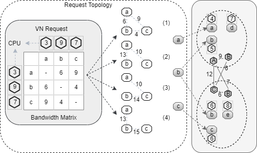

## 上传文件夹
* git bash here
* git init
* git status
* git add .
* git commit -m “备注”
* git reset --hard HEAD^
* git reset --hard HEAD~100
* git reset --hard 版本号
* git reflog
* git checkout -- readme.txt
* rm b.txt
* git remote add origin https://github.com/hanyuntao/text.git
* git push -u origin master
* git branch
* git branch dev
* git checkout dev
* git checkout –b name
* git merge dev
* git branch –d name
* git remote
* git remote –v
* git push origin master
* git pull
  

我是文本，居中显示

 