# 开发文档

## 需求文档

> https://jczh.yuque.com/ffgs6r/umof7l/tckl4opyw6yrsqi9?singleDoc#

## 数据库设计

为表为purchase_intention添加两个字段

```sql
ALTER TABLE purchase_intention
ADD COLUMN release_status TINYINT NOT NULL DEFAULT 0 COMMENT "发布状态 0:编辑中 1：发布中 2：发布成功 3：发布失败",
ADD COLUMN intention_start_time DATETIME NULL COMMENT "项目预计采购时间段（起始）",
ADD COLUMN intention_end_time DATETIME NULL COMMENT "项目预计采购时间段（结束）";
```

## 时序图

