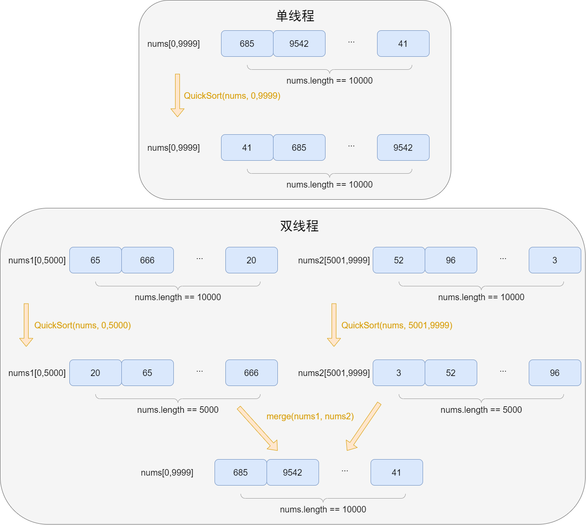
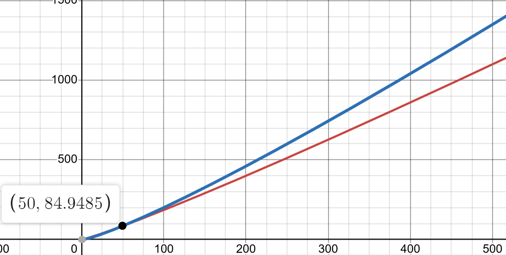
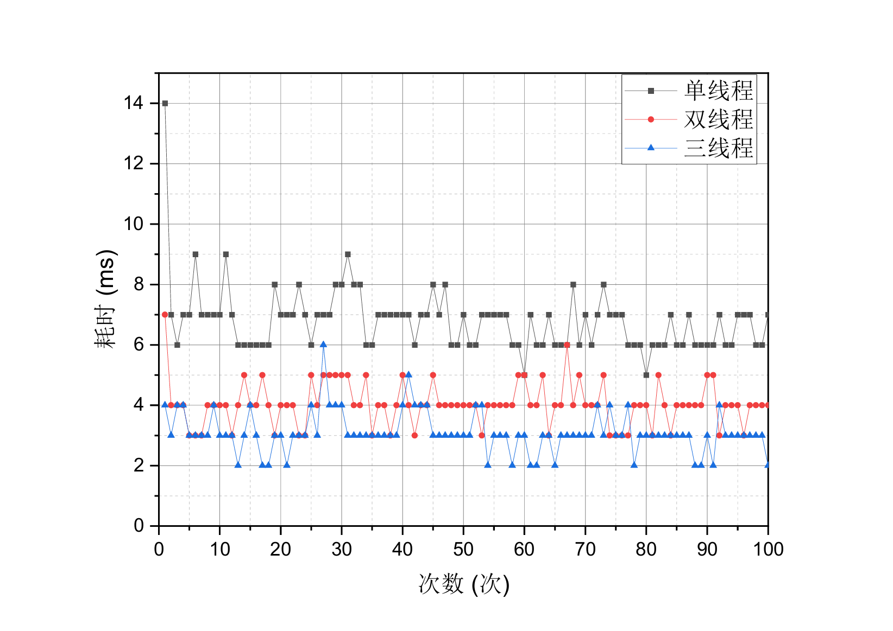
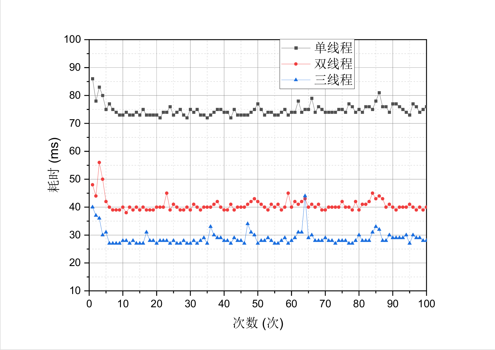
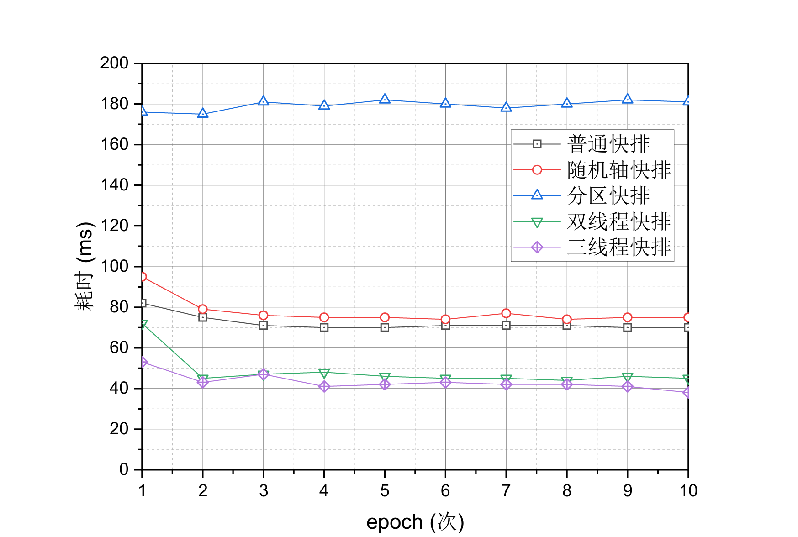

# 
 基于多线程辅助的快速排序算法 

## 问题

对 10000 个随机数使用快速排序算法进行排序使其变为有序状态，现在请思考并提出一个优化思路，以减少程序的运行时间。

## 解决思路

传统的快速排序算法都是使用单个线程的进行的，为了更好的利用电脑的性能，减少排序算法的运行，可以使用多线程的方式为排序算法加速。

## 解决方案

假设有一个包含 10000 个整数的随机数组`nums`。现在的任务是将这个数组变为有序状态。具体步骤为：将`nums`数组的前半部分（从索引 0 到 4999）和后半部分（从索引 5000 到 9999）分别开启一个独立的线程，在每个线程中使用快速排序算法对相应部分进行排序，使其变为有序状态。然后，再使用归并的方法将这两个已经有序的子数组合并成一个完整的有序数组。

## 时间复杂度分析

普通的单线程快排算法的时间复杂的平均为:  

- $O(n) = n\log n$

假设在多线程执行过程中是完全并行且各个线程之间互不影响，那么对于使用双线程进行快速排序的算法，其平均时间复杂度是：

- $O(n) = n(\frac{1}{2}\log {\frac{n}{2}} + 1)$

为了更加直观的展示时间复杂度，这两个函数的图像为：

其中，红色线条为$O(n) = n(\frac{1}{2}\log {\frac{n}{2}} + 1)$的图像，蓝色线条为$O(n) = n\log n$的图像。从图中我们可以发现数组规模`n>50`的时候，单线程算法比双线程算法的时间复杂度要高，且随`n`的值增大而增大。

## 实验分析

因为公司使用的是java编程语言，所以实验的编程语言为java。实验设备的配置如下：
|硬件|型号|性能|
|-|-|-|
|CPU|AMD Ryzen 5 5600U|2.30GHz|
|内存|16GB|1600.0MHz|
|显卡|AMD Radeon(TM) Graphics|400.0MHz|

为了实验结果有区分度，我们使用不同的数组规模，具体如下所示：

|平台|规模|
|-|-|
|java|100w|
|java|10w|

### 实验结果

实验一：10w规模下不同线程数排序耗时对比

通过实验一我们观察到，三种方案在排序时的平均耗时呈现出 “单线程耗时大于双线程耗时，双线程耗时大于三线程耗时” 的情况，然而这种结果并不突出，并且还存在许多与之相反的例子。出现这种情况可能是因为排序的规模较小，容易受到电脑性能波动的影响。

  

实验二：100w规模下不同线程数排序耗时对比

实验二再次证实了在基于快速排序算法的耗时方面，呈现出 “单线程耗时大于双线程耗时，双线程耗时大于三线程耗时” 的规律，并且相比实验一，这种效果更加显著。此外，还可以发现，随着线程的增加算法耗时减少的趋势越小，这可能是由于多线程排序后需要将各个有序段进行归并这一部分比较耗时（在我的算法实现中，归并是使用的单线程），并且线程调度也需要时间。

从这两个实验我们可以得出结论：基于多线程的快速排序算法比单线程的排序算法更好，但是随着线程的增加性能提升的效果降低。

## 展望

在上一部分中，已经提到：归并过程使用单线程会一定程度的增加算法的时间复杂度。因此，未来可以在归并过程中进一步优化基于多线程的快速排序算法。

