# <center>设计文档</center>

<center>UAC-17937-运营平台增值服务查询中增加导出表格功能</center>

## 涉及接口

### 导出已支付订单

#### 接口信息

- **GET** /operation/avs/orders/paid/download
- **接口ID**：222231019
- **接口地址**：https://app.apifox.com/link/project/2483590/apis/api-222231019
- **改动逻辑**：新增的接口

#### 请求参数

|名称|位置|类型|必选|说明|
|---|---|---|---|---|
|buyer|query|integer| 否 |buyer|
|productIds|query|array[string]| 否 |productIds|
|companyId|query|integer| 否 |companyId|
|provinces|query|array[string]| 否 |provinces|
|payStartTime|query|string| 否 |payStartTime|
|payEndTime|query|string| 否 |payEndTime|

## 流程图



## 数据库

数据库无需变动

## 代码

### 附件下载设置统一的请求头

```java
httpServletResponse.setContentType("application/octet-stream");
httpServletResponse.setHeader("Content-Disposition",
                                     "attachment;filename=" + URLUtil.encode(StrUtil.format("增值服务订单导出_{}.xlsx", DateUtil.now()), StandardCharsets.UTF_8));
```

### 组装Excel实体

```java
private List<AvsPaidOrderExcel> assemblePaidOrderExcel(List<AvsPaidOrderVo> vos) {
        List<AvsPaidOrderExcel> excels = new ArrayList<>();
        int num = 1;
        for (AvsPaidOrderVo vo : vos) {
            for (AvsOrderEffectInfoVo attachEffectInfo : vo.getAttachEffectInfos()) {
                AvsPaidOrderExcel excel = new AvsPaidOrderExcel();
                excel.setNum(Integer.toString(num));
                excel.setBuyerMobile(vo.getBuyerInfo().getBuyerMobile());
                excel.setBuyerName(vo.getBuyerInfo().getBuyerName());
                excel.setJoinCompany(Optional.ofNullable(vo.getBuyerInfo().getJoinCompanyInfos()).orElse(new ArrayList<>()).stream()
                        .map(JoinCompanyInfoVo::getCompanyName)
                        .collect(Collectors.joining(",")));
                excel.setEffectName(vo.getEffectInfo().getProductName());
                excel.setAmount(vo.getPayInfo().getAmount());
                excel.setPaidAmount(vo.getPayInfo().getPaidAmount());
                excel.setEffectiveDate(vo.getEffectInfo().getEffectiveDate());
                excel.setEffectiveTime(vo.getEffectInfo().getEffectiveTime());


                SimpleDateFormat sdf = new SimpleDateFormat(DatePattern.NORM_DATETIME_PATTERN);
                excel.setPayTime(sdf.format(vo.getPayInfo().getPayTime()));


                excel.setAttachEffectName(attachEffectInfo.getProductName());
                if (ObjUtil.equals(attachEffectInfo.getProductEffectType(), 1)) {
                    excel.setEffectTotalValue(attachEffectInfo.getEffectiveDate());
                    excel.setEffectRemindValue(attachEffectInfo.getEffectiveTime());
                }
                if (ObjUtil.equals(attachEffectInfo.getProductEffectType(), 2)) {
                    excel.setEffectTotalValue((long) attachEffectInfo.getNumber());
                    excel.setEffectRemindValue((long) attachEffectInfo.getRemain());
                }
                excels.add(excel);
            }
            num++;
        }
        return excels;
    }
```

### 合并单元格的逻辑

```java
public AvsOrderExportMergeStrategy(List<AvsPaidOrderVo> vos) {
        List<CellRangeAddress> addressList = new ArrayList<>();
        int preLastRow = 1;
        for (AvsPaidOrderVo vo : vos) {
            int mergeSize = vo.getAttachEffectInfos().size();
            for (int i = 0; i < 10; i++) {
                CellRangeAddress address = new CellRangeAddress(preLastRow, preLastRow + mergeSize - 1, i, i);
                addressList.add(address);
            }
            preLastRow += mergeSize;
        }

        this.addressList = addressList;
    }
```

### 方案优化

#### 接口分析

1. 查询订单表avs_order
2. 根据订单表中的buyer_id查询用户表user（索引或全表，根据数量判断）
3. 根据订单表中order_id查询avs_order_item信息（无索引，全表查）
4. 根据订单表中order_id查询avs_order_attach信息（无索引，全表查询）
6. 根据buyer_id查询employee表中的公司信息（索引）
7. 根据order_id查询avs_rights_transfer（无索引，全表查询）
8. 根据order_id查询avs_account_transfer（无索引，全表查询）

#### 优化分析

1. 根据order_id查询avs_order_item信息时，可以建立索引来避免全表扫描
2. 根据order_id查询avs_order_attach信息时，可以建立索引来避免全表扫描
3. 根据buyer_id查询employee表中的公司信息时，会调用buyers.size()次数据库（一次一次查询），这非常消耗性能，可以考虑将List<buyer_id>组装起来，一次性查询。（优化后性能可以提升buyers.size()倍！）
4.根据order_id查询avs_rights_transfer的信息时，会调用orders.size()次数据库（一次一次查询），这非常消耗性能，可以考虑将List<order_id>组装起来，一次性查询。（优化后性能可以提升orders.size()倍！）
5.根据order_id查询avs_account_transfer的信息时，也一样
```sql
# 优化前
select * from employee LEFT JOIN company on employee.company_id=company.id where user_id = 2;
select * from employee LEFT JOIN company on employee.company_id=company.id where user_id = 3;
select * from employee LEFT JOIN company on employee.company_id=company.id where user_id = 4;
select * from employee LEFT JOIN company on employee.company_id=company.id where user_id = 5;
select * from employee LEFT JOIN company on employee.company_id=company.id where user_id = 6;
select * from employee LEFT JOIN company on employee.company_id=company.id where user_id = 7;
select * from employee LEFT JOIN company on employee.company_id=company.id where user_id = 12;
select * from employee LEFT JOIN company on employee.company_id=company.id where user_id = 15;

# 优化后
select GROUP_CONCAT(company.company_name SEPARATOR ', ') AS company_names from employee LEFT JOIN company on employee.company_id=company.id where user_id in (2,3,4,5,6,7,12,15,21,30,32,35,45,48,74,109,151,154,156,163,165,168,172,174,176,285) GROUP BY user_id;
```

<center>

|方案|运行时间|
|-|-|
|优化前|3.2s|
|优化后|0.4s|

</center>
可以得出结论：在数据量为n的时候，优化前的耗时是优化后的n倍。