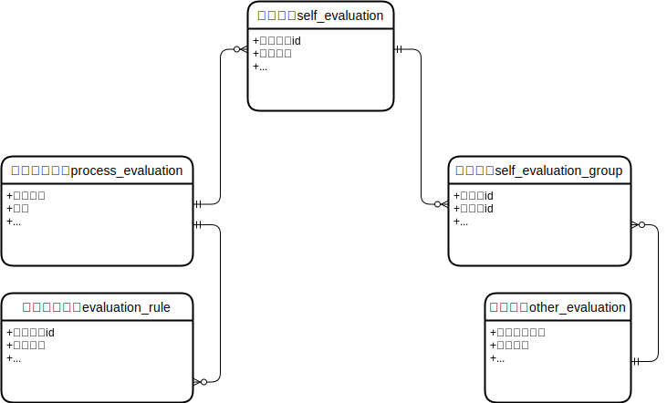

# 设计文档

## 流程图

## 表结构设计

### ER图

### 表结构

#### 评价规则表：evaluation_rule

|字段名称|数据类型|备注|
|-|-|-|
|id|bigint|主键|
|process_evaluation_id|bigint|环节评价 id|
|rule_name|varchar(255)|规则名称|
|score|varchar(255)|得分|
|create_time|datetime|创建时间|
|update_time|datetime|修改时间|

#### 环节评价表：process_evaluation

|字段名称|数据类型|备注|
|-|-|-|
|id|bigint|主键|
|process_code|varchar(20)|代码|
|business_node|varchar(255)|业务节点|
|first_index|varchar(255)|一级指标|
|second_index|varchar(255)|二级指标|
|self_evaluation|varchar(255)|评价点|
|create_time|datetime|创建时间|
|update_time|datetime|修改时间|

#### 自评表：self_evaluation

|字段名称|数据类型|备注|
|-|-|-|
|id|bigint|主键|
|process_evaluation_id|bigint|环节评价 id|
|business_data|json|业务数据|
|evaluation_rule_id|bigint|评价规则 id|
|score|varchar(255)|自评得分|
|evaluation_time|datetime|自评时间|
|create_employee_id|bigint|创建员工 id|
|create_time|datetime|创建时间|
|update_time|datetime|修改时间|

#### 整改表：other_evaluation

|字段名称|数据类型|备注|
|-|-|-|
|id|bigint|主键|
|other_evaluation_name|varchar|其他评价名称|
|rectification_year|varchar|整改年度|
|dept_id|bigint|整改所属部门|
|evaluation_result|tinyint|评价结果，0：不及格，1：及格，2：良好，3：优秀|
|rectification_situation|tinyint|整改情况，0：未整改，1：已整改|
|status|tinyint|状态，0：编辑中，1：审批中，2：审批不通过，3：审批通过|
|supervisory_agency|varchar|监督检查机构|
|rectification_time|datetime|整改时间|
|rectification_attachments|json|整改附件|
|create_employee_id|bigint|创建员工id|
|create_time|datetime|创建时间|
|update_time|datetime|修改时间|

#### 表名：self_evaluation_group

|字段名称|数据类型|备注|
|-|-|-|
|id|bigint|主键|
|self_evaluation_id|bigint|自评id|
|other_evaluation_id|bigint|整改id|
|remark|varchar|备注|
|create_time|datetime|创建时间|
|update_time|datetime|修改时间|
