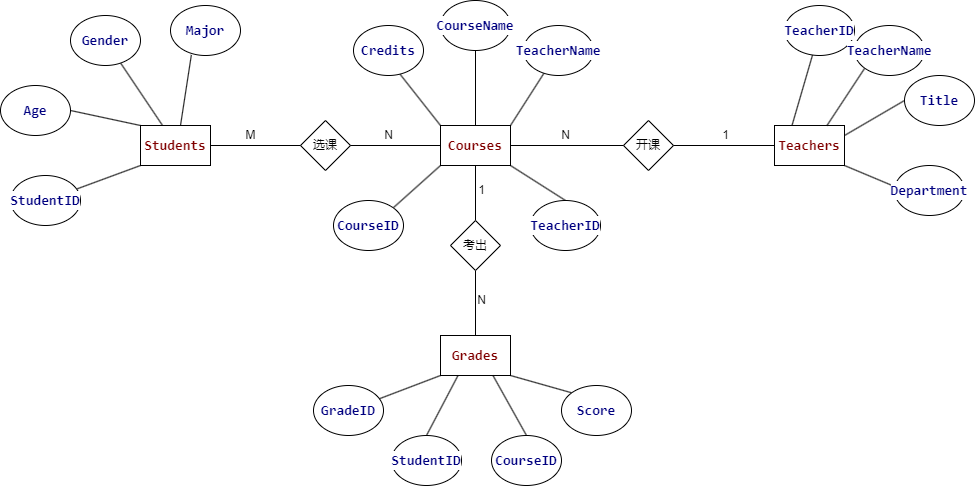

# 
数据库设计

## 需求分析
- __学生__：学生可以登录账号并查看自己的成绩信息。
- __老师__：老师可以录入学生成绩、修改学生成绩。
- __管理员__：管理员可以添加修改学生与老师的账户信息。
## 数据库表设计
### 用户表（Users）
- __UserID__（主键，唯一标识符）
- __Username__（用户名，唯一）
- __Password__（加密存储的密码）
- __Role__（角色，枚举类型，如'Student'、'Teacher'、'Admin'）
- __Email__（电子邮件地址）
- __PhoneNumber__（联系电话）
### 学生信息表（Students）
- __StudentID__（外键，引用Users的UserID）
- __Age__（年龄）
- __Gender__（性别）
- __Major__（专业）
### 老师信息表（Teachers）
- __TeacherID__（外键，引用Users的UserID）
- __TeacherName__（名字）
- __Title__（职称）
- __Department__（所属院系）
### 课程表（Courses）
- __CourseID__（主键，唯一标识符）
- __TeacherID__ （外键，关联Teachers）
- __TeacherName__（授课老师）
- __CourseName__（课程名称）
- __Credits__（学分）
### 成绩表（Grades）
- __GradeID__（主键，唯一标识符）
- __StudentID__（外键，关联Students） 
- __CourseID__（外键，关联Courses）
- __Score__（成绩）
## ER图
