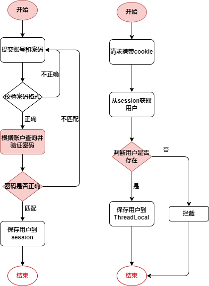

# 
登录模块

## 需求分析
- __输入验证__：验证账号和密码的格式（前端任务）。
- __身份认证__：将用户输入的账号和密码与数据库中的记录进行比对，确认用户身份。
- __会话管理__：登录成功后，使用session记录用户会话信息，根据用户身份提供相应功能。
- __用户登出__：提供明确的登出按钮或链接，用户点击后清除session信息，确保用户会话安全结束。

## 登录流程图

