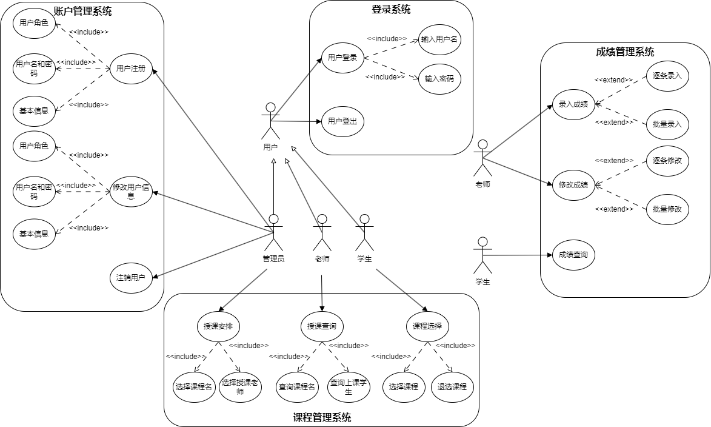
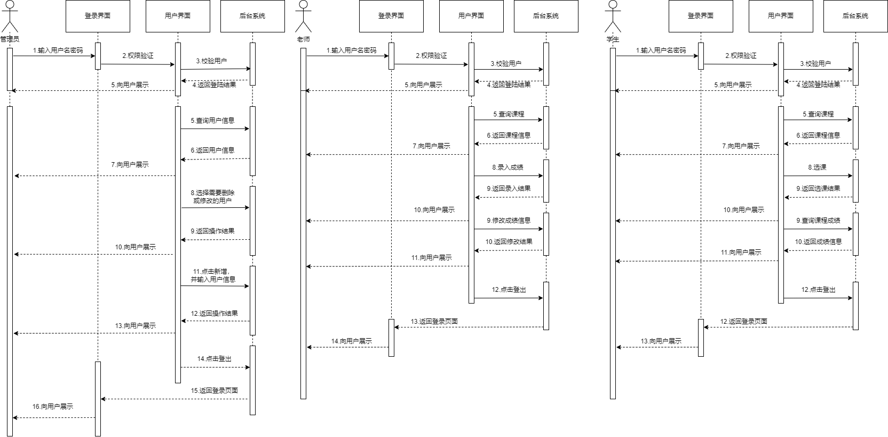
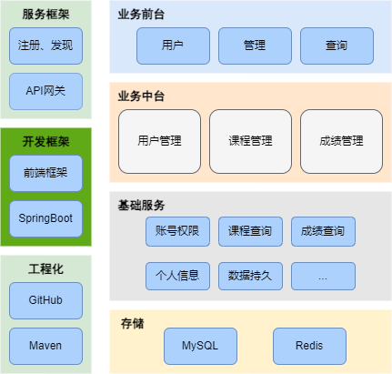
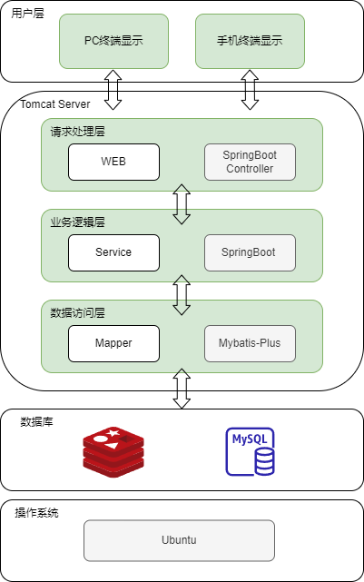

# 
 学生管理系统用例图 

# 用例图

### 需求分析

- __学生__：学生可以登录账号、选择或者退选课程、查看自己的成绩信息。
- __老师__：老师可以录入学生成绩、修改学生成绩、查询所需教授的课程信息。
- __管理员__：管理员可以添加新用户（包括学生和老师）、修改用户信息、安排老师教授课程。

### 参与者

- __管理员__
- __老师__
- __学生__

### 用例

#### 账户管理系统：

>##### 管理员
>
>- 用户注册
>    1. 输入用户角色
>    2. 输入用户名和密码
>    3. 输入基本信息
>- 修改用户信息
>    1. 修改用户角色
>    2. 修改用户名和密码
>    3. 修改基本信息
>- 注销用户

#### 登录系统：

> ##### 管理员、老师、学生
>
>- 用户登录
>    1. 输入用户名
>    2. 输入密码
>- 用户登出
>
#### 课程管理系统：

>##### 管理员
>
>- 授课安排
>    1. 选择课程名
>    2. 选择授课老师

>##### 老师
>
>- 授课查询
>    1. 查询课程名
>    2. 查询上课学生

>##### 学生
>
>- 课程选择
>    1. 选择课程
>    2. 退选课程

#### 成绩管理系统：

>##### 老师
>
>- 录入成绩
>    - 逐条录入
>    - 批量录入
>- 修改成绩
>    - 逐条修改
>    - 批量修改

>##### 学生
>
>- 成绩查询

# 时序图

# 架构图

## 业务架构图

  

## 系统架构图

  

