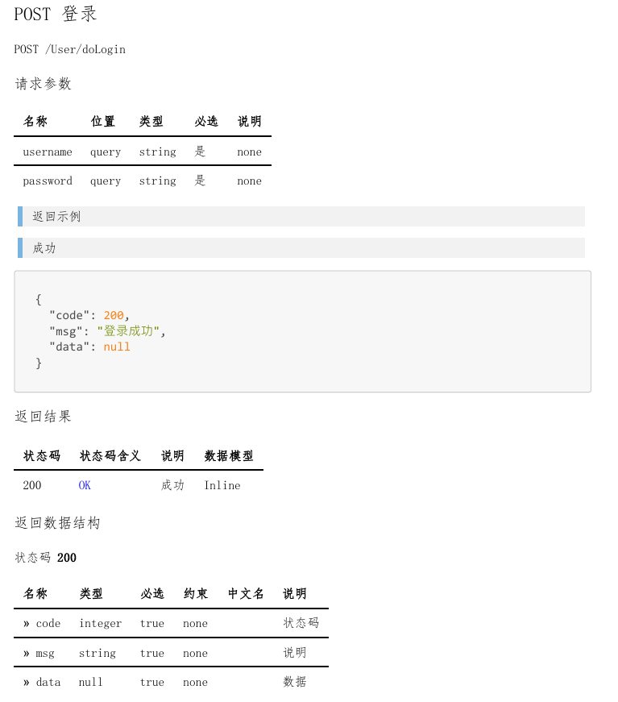

# 
 规范代码从规范文档开始 

在软件开发的进程中，规范且清晰的文档是项目成功的基石。它不仅有助于团队成员之间的高效沟通与协作，更是保障代码质量和项目顺利推进的关键。本汇报将重点介绍如何运用 Visual Studio Code（VS Code）、Markdown 以及 Drawio 来规范各类重要文档的编写，涵盖软件架构、需求文档、API 文档等。

> 我今天分享的主题是《规范代码从规范文档开始》，选择这个主题的原因是这些天凯哥开会的时候经常谈到规范谈到标准，而且这些天在他的指导下完成了入门项目的开发和相关文档的书写。所以我今天分享一下文档方面的规范。

## 规范文档的好处

1. 提高沟通效率

> 一个规范的需求文档可以让开发人员、测试人员快速理解项目的目标，减少不必要的沟通。

2. 便于知识传承

> 新员工入职时，如果有规范业务流程文档和操作指南，他们可以更快地熟悉工作，融入团队。老员工离职时，其积累的经验更顺利的交接给后续的同事。

3. 增强可维护性

> 在一个软件系统中，规范的架构文档能帮助后续的维护人员快速理解系统和定位问题。

## 举例说明

- API文档规范
    - 支持的请求方法、URL。
    - 请求参数、请求体。
    - 响应和响应结果。

> 一个API请求的文档一个包含，支持的请求方法、URL等等，如图所示。

- 用例图规范
    - 需求
    - 参与者
    - 用例

> 一个规范的用例图应该包含需求、参与者和用例等等。

## 文档解决方案（参考）

> 大家使用同一套文档解决方案，可以大大提高文档维护的效率。这是一个参考的解决方案，VSCode世界上最受欢迎的代码编辑器、Markdown让我们专注创作，不用花时间在格式上、drawio一款轻量化且功能强大的绘图工具。以上可以解决我们文档规范的基本要求。我的分享结束了~ 希望以后各位同事多多指教~

1. Visual Studio Code (VS Code)
    - 一款功能强大、扩展性高的代码编辑器。
    - 支持多种编程语言和插件，提供舒适的编辑体验。
2. Markdown（插件）
    - 简单易学的标记语言，专注于内容创作。
    - 能快速将纯文本转换为格式良好的文档。
3. Drawio（插件）
    - 强大的绘图工具，用于创建各类图表。

