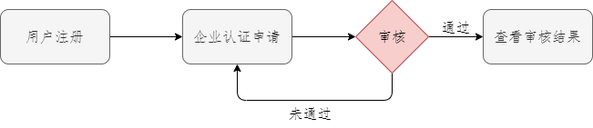
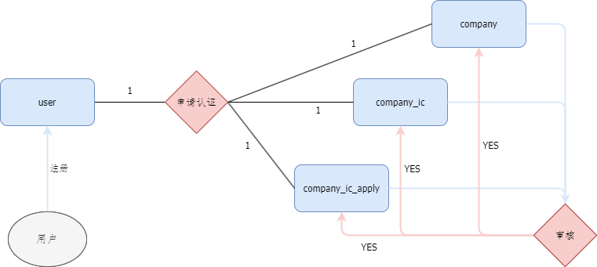

# <center> 注册模块开发文档 </center>

## 流程图

<center>  </center>

## ER图

<center>  </center>

## 接口

### POST 用户注册

POST /supplier/register

> Body 请求参数

```json
{
    "mobile": "123456789",
    "password": "666666",
    "username": "name"
}
```

### POST 企业认证申请提交

POST /supplier/auth/submit

> Body 请求参数

```json
{
    company_name: "公司名称",
    social_credit_code: "社会信用代码",
    area: "地区",
    detail_address: "详细地址",
    legal_person_name: "法人姓名",
    legal_person_phone: "法人手机号码",
    legal_person_identity_number: "法人身份证号码",
    legal_person_card_front: "法人身份证正面",
    legal_person_card_back: "法人身份证反面"
}
```

### PUT 企业认证申请修改

PUT /supplier/auth/updata

> query 请求参数

|名称|位置|类型|必选|说明|
|-|-|-|-|-|
|companyIcapplyId|query|integer|是|none|

> Body 请求参数

```json
{
    company_name: "公司名称",
    social_credit_code: "社会信用代码",
    area: "地区",
    detail_address: "详细地址",
    legal_person_name: "法人姓名",
    legal_person_phone: "法人手机号码",
    legal_person_identity_number: "法人身份证号码",
    legal_person_card_front: "法人身份证正面",
    legal_person_card_back: "法人身份证反面"
}
```

### 查看审核结果

GET /supplier/auth/query

> Query 请求参数

|名称|位置|类型|必选|说明|
|-|-|-|-|-|
|companyIcapplyId|query|integer|是|none|