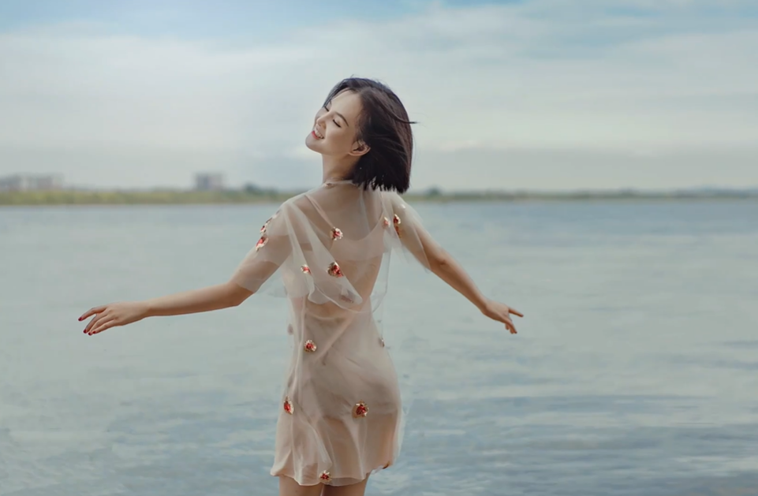
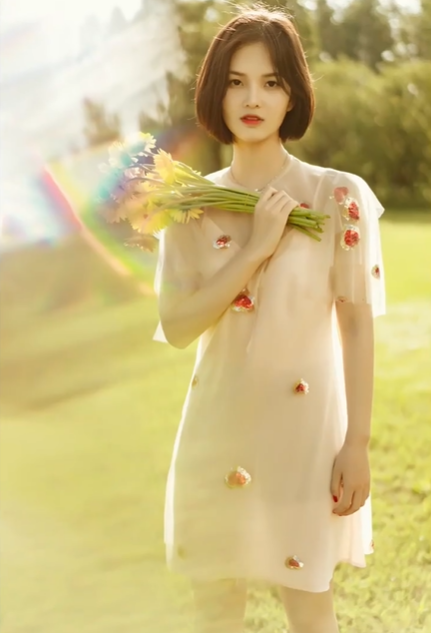
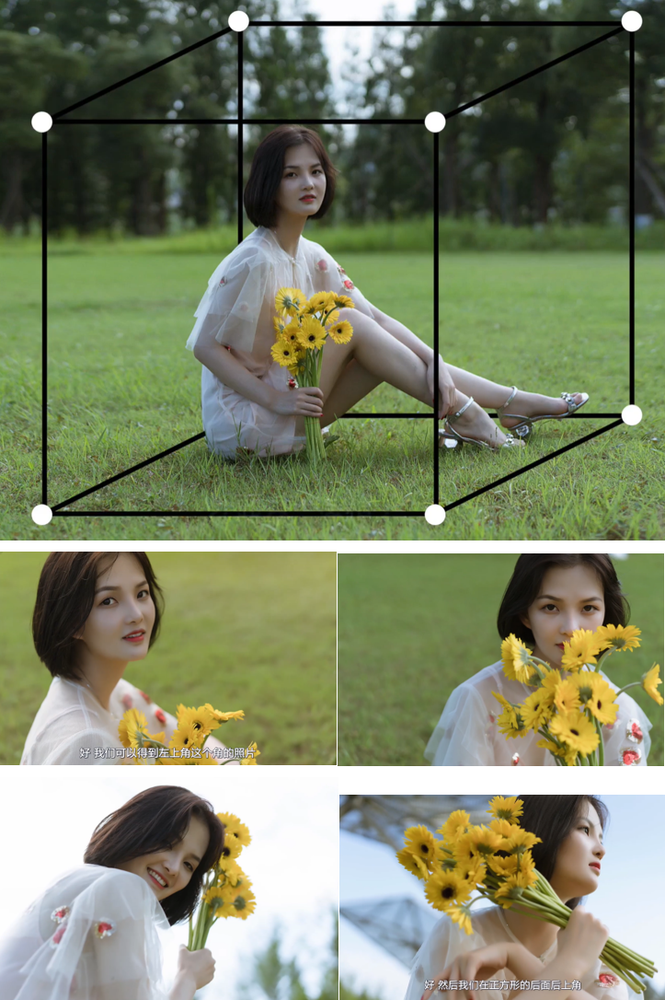
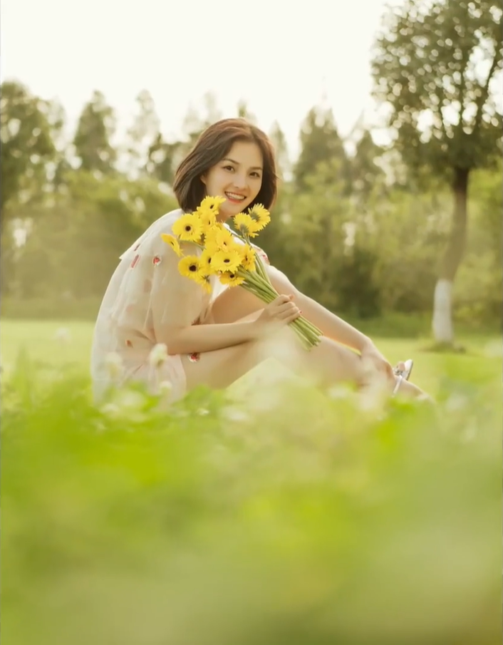
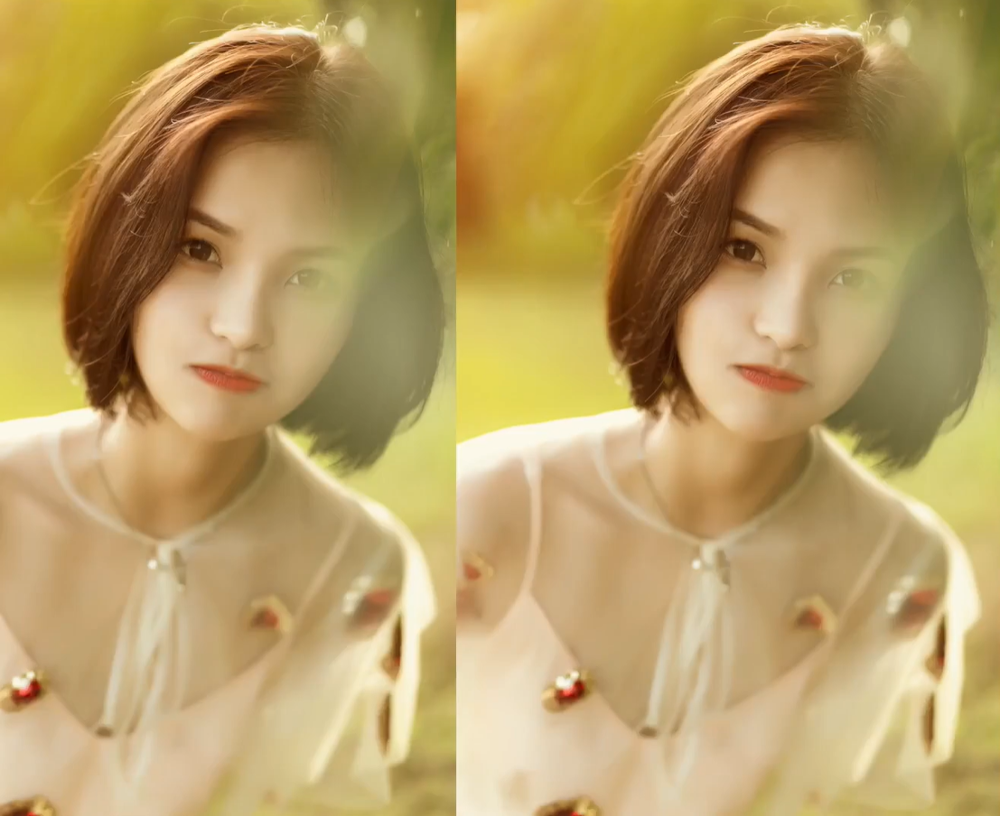
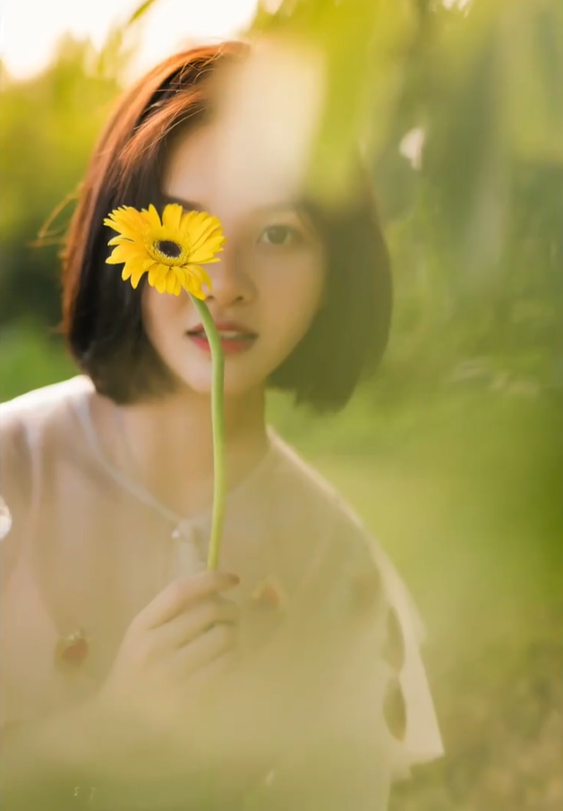
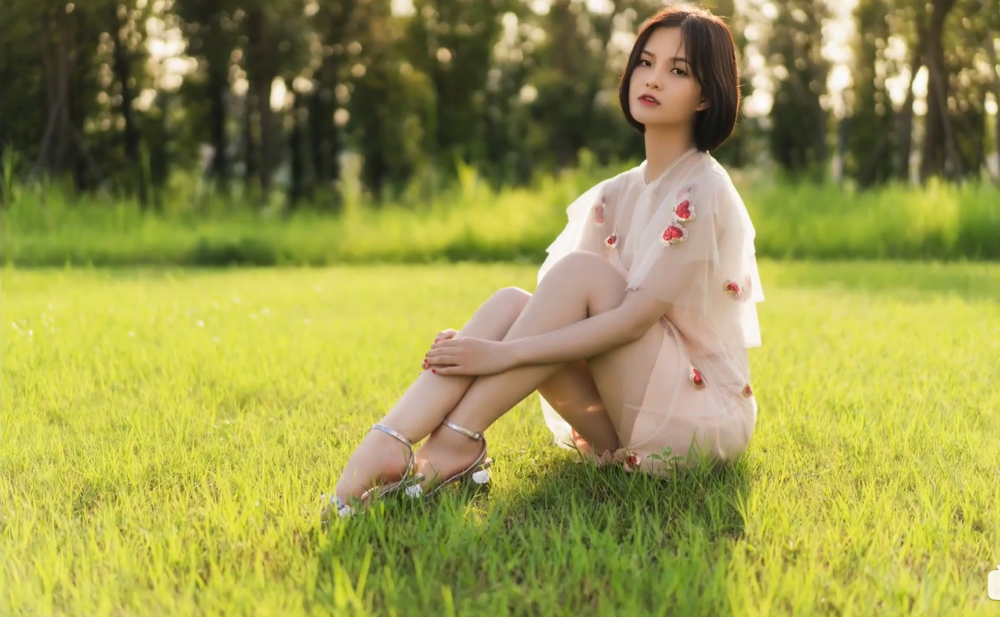
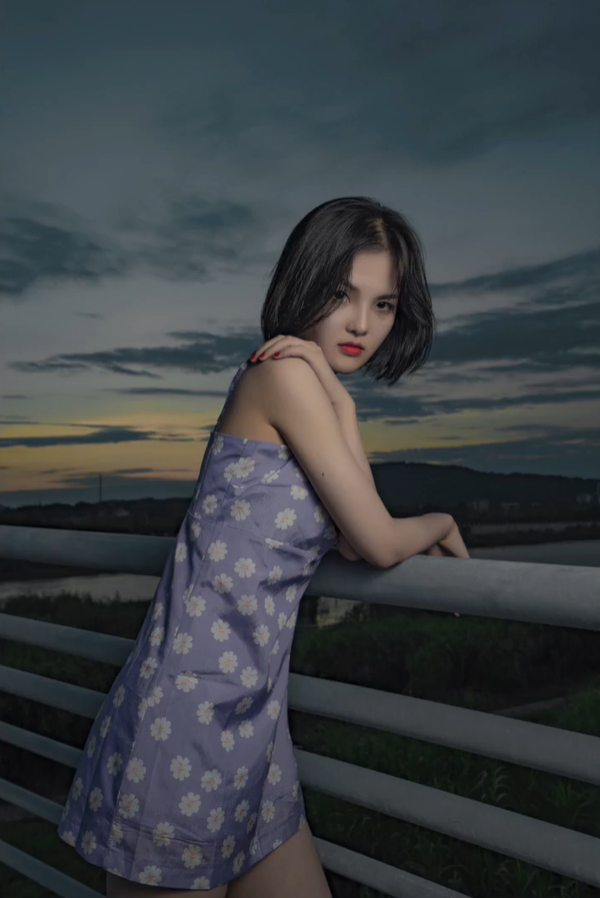

# 户外人像技巧
## 了解模特
> 和模特聊一聊天，多个角度拍一拍。找到模特好看的角度，从而避开模特的缺点。
> 并且将相机参数调整好，选择合适的焦段
## 选择适合的前景线条
> 利用扶手的转角将模特聚焦

## 将模特融入环境，不要让模特一直看镜头
> - 拍半身或者全身照
> - 拍摄横构图融入更多的环境
> - 因为模特不看镜头，可以使用抓拍来使照片更加自然

## 借助道具创造前景虚化
> - 利用眼镜制造一个范围
> - 利用丝袜制造猛然感
> - 利用树叶给画面增添元素

## 正方体构图
> - 这种方法不挑场地，稳定出片

## 利用前景
> - 相机角度放低，利用地面的花草做前景。
> - 利用树叶做前景
> - 不同的表情
<figure class="third">

</figure>
## 图片裁切
> - 不能裁切像外扩的部位（胸部、臀部）
> - 不能裁切关节部位
> - 尽量裁切腰部、小腿
## pose
> - 腿部pose，腿部交叉、45°、后脚前伸，后脚在前脚前面

## 闪光灯
> - 以天空为背景需要用闪光灯或反光板来补充模特的光
<figure class="third">

</figure>