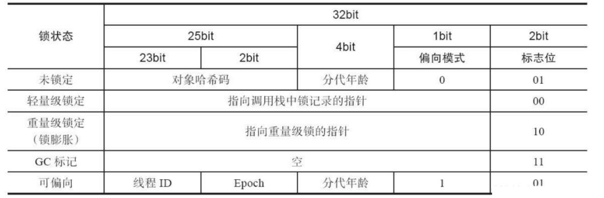
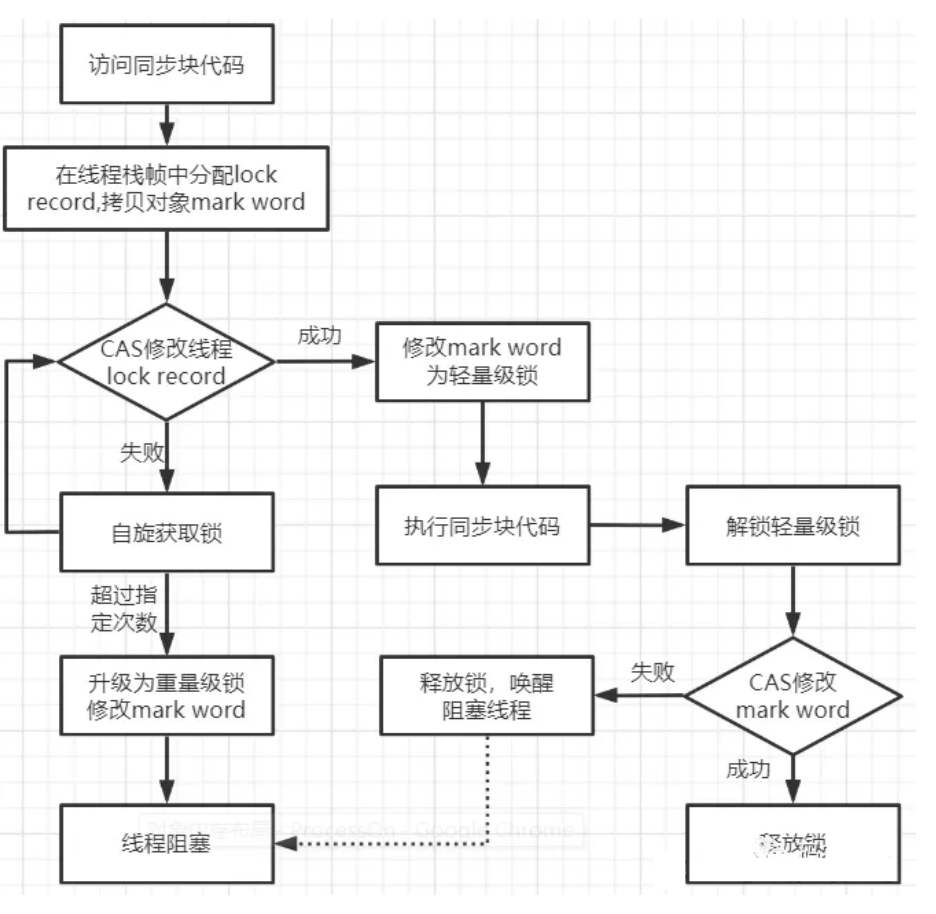
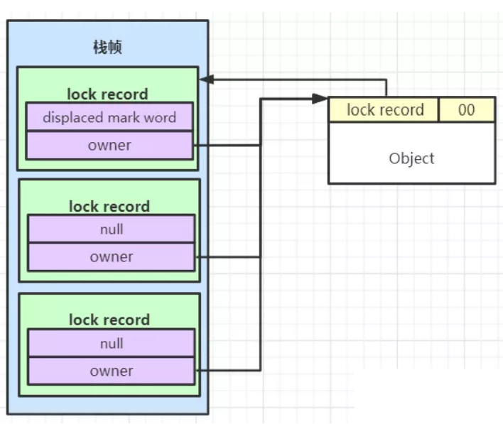
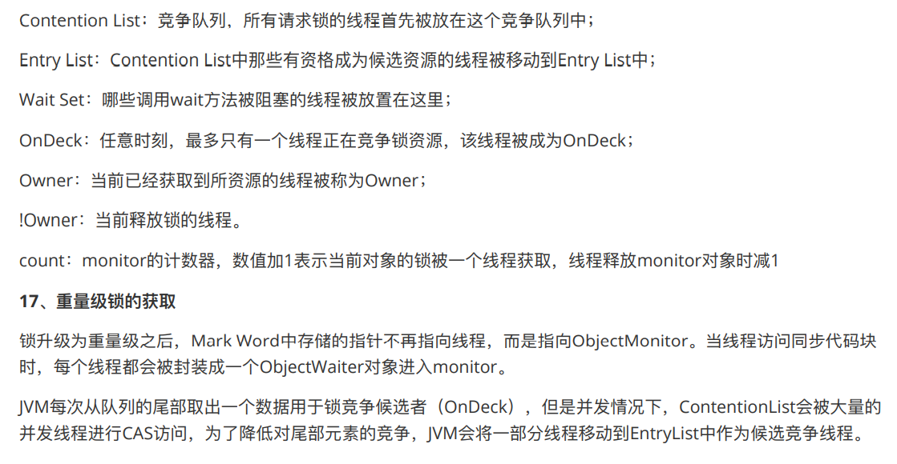
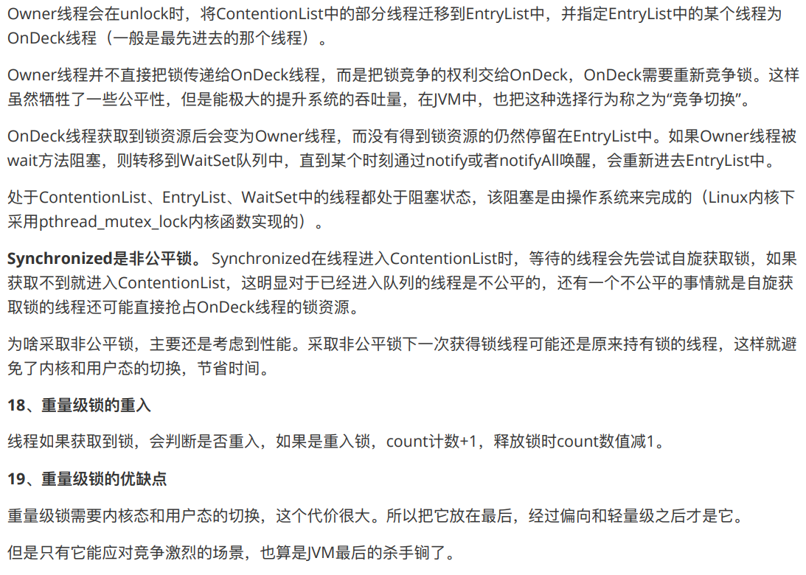
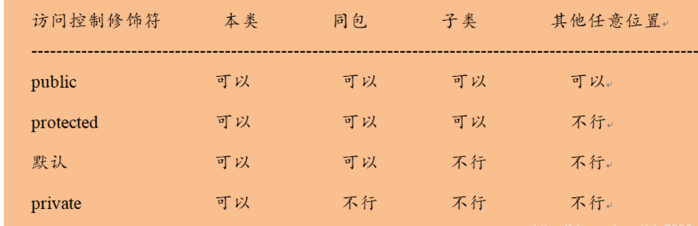

# java基础
## java基础概念
### jvm，jre，jdk之间的关系
- jvm：java虚拟机，将扩展名为.class的字节码文件解释成具体系统平台的机器指令。
- jre：java运行时环境，只能运行.class文件，不能编译。包含了一个jvm，与java核心类库与其所支持的文件。
- jdk：包括了Java运行环境JRE（Java Runtime Envirnment）、一堆Java工具（javac/java/jdb等）和Java基础的类库（即Java API 包括rt.jar）。
### public、protected、default、private的区别
||同类|同包|不同包子类|不同包非子类|
|--|--|--|--|--|
|private|yes|
|default|yes|yes|
|protected|yes|yes|yes|
|public|yes|yes|yes|yes|
- public表明该数据成员、成员函数是对所有用户开放的，所有用户都可以直接进行调用。
- private表示私有，私有的意思就是除了class自己之外，任何人都不可以直接使用，私有财产神圣不可侵犯嘛，即便是子女，朋友，都不可以使用。
- protected对于子女、朋友来说，就是public的，可以自由使用，没有任何限制，而对于其他的外部class，protected就变成private。
- default：java的默认访问权限，当没有使用上面提到的任何访问限定词时，就使用它，这种权限通常被称为包访问权限，在这种权限下，类可以访问在同一个包中的其他类的成员，也即可以访问我们前面说的朋友，在包之外，这些成员如同指定了private。
### final、finally、finalize的区别
- 被final修饰的类，就意味着不能再派生出新的子类。被final修饰的变量或方法，可以保证他们在使用过程中不被修改（不能重写方法）。
- finally是异常处理的一部分，只能用在try、catch中，无论是否抛出异常都会执行。（执行try或者catch时被打断或者被终止，finally可能不会执行）
- ​ 对象被判定死亡以后，还有机会挣扎一下。重写finalize()方法，finalize()只会在对象内存回收前被调用一次，这是由finalizer线程执行的。目的是处理一些善后工作，但是这样的垃圾太多会影响性能。
### static关键字
- 作用：解决对象共同属性浪费空间的问题
- 类加载时就准备就绪了，与是否创建对象无关，所有对象共享
- 对象没有创建的时候就可以访问（直接用类名点）
### 面向对象、面向过程
- 面向过程的性能比较高，应为没有实例化等操作，开销比较小
- 面向对象应为有了封装继承多态的特性，可以设计出低耦合的系统，ֵ使得系统更灵活、容易维护。
- 封装成抽象的类，并且对可信的类或者对象，是可以操作的，对于不可信的进行隐藏。
- 继承是指可以使用现有类的所有功能，而且还可以在现有功能的基础上做拓展。
- 多态是基于继承的，他是指父类中定义的属性和方法被子类继承之后，可以具有不同的数据类型或者表现出不同的行为。使得同一个属性在弗雷机器子类中具有不同的含义。
- 重载是编译时的多态
### 重载和重写都是实现多态的方式，区别是啥？
区别在于重载是编译时多态，重写是运行时多态。
## ArrayList
### ArrayList底层数组默认初始化容量为10
- jdk1.8中ArrayList底层先创建一个长度为0的数组
- 当第一次添加元素时，会初始化为一个长度为10 的数组。
### 当ArrayList中的容量使用完之后，则需要进行扩容：
- ArrayList会自动1.5倍扩容，并将原素组中的所有元素拷贝过去，这会导致低效率。
- 可以使用构造方法给一个初始化容量。
### ArrayList 构造⽅法
- ArrayList():创建一个初始化容量为10的空列表
- ArrayList(int initialCapacity)：创建一个指定初始化容量为initialCapacity的空列表
- ArrayList(Collection<? extends E> c)：创建一个包含指定集合中所有元素的列表
### ArrayList特点
#### 优点
- 向ArrayList末尾添加元素时效率高
- 查询效率高
#### 缺点
- 扩容会造成效率低（指定初始化容量可以一定程度上改善）
- 数组无法存储大数据量（很呐找到一块很大的连续的内存空间）
- 向ArrayList中间添加元素，需要移动元素效率低
### LinkedList
- 底层是双向链表
- 优点：增删效率高
- 缺点：查询效率低
LinkedList也有下标，但是内存不一定是连续的每次查询都要从头节点开始遍历。
### ListIterator接口
- LinkedList.add方法只能将数据添加到链表的末尾
- 如果要将对象添加到链表的中间位置需要使用ListIterator接口的add方法，ListIterator是Iterator的一个子接口
- 迭代器是以游标是形式存在
### Vector
- Vector底层是数组，初始化容量为10
- 自动扩容为2倍
- Vector是线程安全的
### CopyOnWriteArrayList
- 使用volatile修饰内部数组
- 加锁（在增，删，改操作时添加锁，而不会在读操作时加锁。）
- 使用COW思想操作数组。
读操作为什么不加锁？
当然是为了提高读操作的效率啦
既然加锁了为什么不能直接操作源数组？
因为读操作没有加锁。增删改操作时，读操作可以在任何一步时获取数组里的值。
既然使用COW就可以保证读操作不出现异常，那为什么还要加锁？
加锁是为了保证和其他写操作不冲突。

## set
### 范型的好处
- 减少强制类型转换的次数
- 调用方法更加安全
- 范型只在编译时期起作用（运行阶段jvm看不见范型类型）
- 带范型的类型没有使用范型时。默认使用Object
- lambda
## Queue
### LinkedList
- 可以用双向链表来实现双向队列
### Priority
- 基于堆结构实现，可以用它来实现优先队列 
## Map
- Map和Collection没有继承关系
- Map以（key，value）的形式存储数据：键值对key和value存储的都是对象的内存地址（引用）
### Map的遍历方式
#### 第一类方法
先获取map的keyset，然后去除key对应的value
#### 特点
小路相对较低
- 方法一：通过foreach遍历map。keySet()，取出对应的value
- 方法二：通过迭代器迭代map.keySet()，来去除对应的value
#### 第二类方法
调用map.entrySet()方法，获取entrySet,然后直接从entrySet中获取key和value
#### 特点
- 效率较高
- 适用于大数据量map遍历
- 方法三：调用map.entrySet()，然后使用foreach遍历entrySet
- 方法四：调用map.entrySet()，然后使用迭代器遍历entrySet
### HashMap
- HashMap底层是一个数组
- 数组中每个元素是一个单向链表（采用拉链法解决哈希冲突）
- 同一个单链表中所有Node的hash值不一定一样，但是他们对应的数组下标一定一样（数组下标利用哈希函数/哈希算法根据hash值计算得到的）
- HashMap是数组和单链表的结合体
- HashMap特点
  - 无序、不可重复
- 为什么不可重复？
  - 通过重写equals方法保证的
#### HashMap部分源码解析
- HashMap默认初始化容量：16
  - 必须是2的次幂
  - 这是为了达到散列均匀，为了提高HashMap集合的存取效率
- HashMap默认加载因子：0.75（数组达到3/4时，开始扩容）
- jdk8之后，对HashMap底层数据结构进行了改进
  - 单链表元素超过八个变为红黑树，红黑树小于6个变为单链表
#### put()方法原理
- 先将key,value封装到Node对象中
- 底层会调用key的hashCode()方法得出hash值
- 通过哈希函数，将hash值转换为数组的下标
  - 如果下标位置上没有任何元素，就把Node添加到这个位置上
  - 如果下标位置上有单链表，此时会将当前Node中的key与链表上每一个节点的key进行equals比较，如果所有的方法返回都是false，那么这个新节点Node将被添加到链表的末尾，如果其中有一个equals返回了true，那么链表中对应的这个节点的value将会被新节点Node覆盖
- HashMap中允许key和value为null
#### get()方法原理 
- 放在HashMap中的key元素（或者放在HashSet中的元素）需要同时重写hashcode()和equals()方法
- 重写hashCode()方法时要达到散列分布均匀
  - 如果hashCode()方法返回一个固定的值，那么HashMap底层变成一个链表
  - 如果hashCode()方法所有返回的值都不同，此时HashMap底层变成一个数组
### TreeMap
- TreeSet/TreeMap是自平衡二叉树
- TreeSet/TreeMap迭代器采用的是中序遍历方式
#### TreeMap特点
无序、不可重复、但是可排序
#### 排序规则
- TreeSet/TreeMap中key可以自动对String类型或者8大基本类型的包装类型进行排序
- 直接将自定义类型添加到TreeSet、TreeMap中key会报错java.long.ClassCastException
原因：自定义没有实现java.lang.Comparable接口，有两种解决方案
- 方案一：实现java.lang.Comparable接口，并重写compareTo方法
- 方案二：选择TreeSet、TreeMap带比较器参数的构造器，并重写比较器中的compare方法。
  - 定义一个Comparator接口的实现类
  - 使用匿名内部类（匿名内部类是局部内部类的一种简化形式.本质上是一个对象,是实现了该接口或继承了该抽象类的子类对象.）
  - lambda表达式（Comparator是函数式接口：只能有一个抽象方法的接口）（Lambda表达式本质是一个匿名函数）
- 比较规则不改变是选方案一，比较规则有多个选择方案二
### LinkedHashMap
- 使用双向链表来维护元素的顺序
- 默认是插入顺序或者最近很少用的lru顺序

## 迭代器
Collection实现了Iterable接口，map没有实现。
map可以通过
```
Iterator<Map.Entry<String,String>> it=m.entrySet().iterator();
```
的方式使用迭代器遍历。
- hasNext()：return cursor != size();
- next()：返回当前下标的元素
- remove：删除下标为lastRet的元素。
## 适配器
java.util.Arrays#asList() 可以把数组类型转换为 List 类型。
```
@SafeVarargs
public static <T> List<T> asList(T... a)
```
应该注意的是 asList() 的参数为泛型的变长参数，不能使用基本类型数组作为参数，只能使用相应的包装类型数组。
```
Integer[] arr = {1, 2, 3};
List list = Arrays.asList(arr);
```
也可以使用以下方式调用 asList()：
```
List list = Arrays.asList(1, 2, 3);
```
## String存储原理
- String类型是不可变的
- Java中用双引号括起来的字符串，例如："abc","def"，都是直接存储再"方法区"的字符串常量池中的
- 为什么把字符串存储在一个字符串常量池中呢？
  - 因为字符串在实际的开发中使用太频繁
  - 为了提高执行效率，
### String、StringBuilder、StringBuffer部分源码解读
- String底层数组用final修饰，不可变
- StringBuilder底层数组没有用final修饰，可变；线程不安全，效率高
- StringBuffer底层数组没有用final修饰，可变；线程安全，效率低。
## 对象构造
### 重载
重载只能通过参数列表（个数，类型）来区分，不能通过方法的返回类型区分
### 无参构造器
- 编写一个类没有编写构造器，系统会提供一个无参构造器
  - 这个构造器将所有的实例域设置为默认值
  - 数值型设为0，布尔型设为false，对象设为null
- 类中至少提供一个构造器
### 显式域初始化
- 实例字段初始化在构造器之前执行
- 当一个类的所有构造器都希望把相同的值赋予给某个特定的实例域时，这种方式特别有用。
### 调用另一个构造器
- 关键字this引用方法的隐式参数
- 构造器的的第一个语句形如this（），调用另一个构造器
### 初始化块
初始化数据域的方法：
- 在构造器中设置值
- 在声明中赋值
- 初始化块
### 对象初始化块

```
{

}
```
静态初始化块
- 如果堆类的静态域进行初始化的代码比较复杂，那么可以使用静态的初始化块
- 静态初始化块只执行一次，且在对象初始化块之前执行
```
static {

}
```
### 对象析构与finalize方法
- java有自动的垃圾回收器，不需要人工回收内存
- java不支持析构器
- 如果某个资源需要在使用后立刻被关闭，对象用完时，可以应用一个close方法来完成相应的清理操作。
## synchronized关键字
java中的锁分为显示锁和隐式锁。隐式锁由synchronized关键字实现，而显示锁是由实现了Lock和AQS框架等类来实现
### 乐观锁
认为不会有其它线程同时操作同步块，如果有就放弃数据，从新读取。
### 悲观锁
认为总是发生数据冲突，先把同步块锁住，完成操作后再释放锁。
### synchronized关键字
java中的每个对象都可以作为锁，有三种加锁的方式：
- 对于普通同步方法，锁是当前实例对象
- 对于静态同步方法，锁是当前类的Class对象
- 对于同步方法块，锁是Synchonized快好礼配置的对象
### 对象头
对象由对象头、实例数据和对其填充组成（数组加一个size）
对象头在32位系统中是32bit在64位系统中是64bit

### 偏向锁的获取

### 批量偏向与批量撤销
偏向锁有三个参数：
- BiasedLockingBulkRebiasThreshold:偏向锁重偏向阈值，默认20（偏向锁竞争达到二十次，未被膨胀为轻量级锁的偏向锁重偏向）
- BiasedLockingBulkRevokeThreshold：偏向锁批量撤销阈值，默认40（偏向锁竞争达到40次，所有偏向锁升级为轻量级锁，并且新对象默认不可偏向）
- BiasedLockingDecayTime：重置计数延迟。默认25秒
### 偏向锁的优缺点
优点：
在只有单一线程访问对象的时候，偏向锁几乎没有影响。只有第一次需要CAS操作替换，随后的只要比较线程ID即可，比较方便快捷。
缺点：
如果有多个线程访问，就会出现竞争，竞争需要等到安全点时，并且进行一系列分析比较耗时。
## 轻量级锁
设计的初衷是在没有多线程竞争的前提下，减少传统的重量级锁使用操作系统互斥量产生的性能消耗。
### 轻量级锁的获取
虚拟机首先在当前线程的栈帧中建立一个名为Lock Record的空间，此空间包含两部分：
- displaced mark word：用于存储锁对象目前的Mark Word的拷贝
- owner：指向当前的锁对象的指针
虚拟机首先会将对象的Mark World拷贝到栈帧中的Lock Record，此时owner为空。
然后虚拟机使用CAS操作尝试把对象的Mark Word更新为指向Lock Record的指针，成功代表线程拥有了这个对象锁，如果失败则会判断Mark Word存储的指针是否指向自己，如果是则表示拥有锁，如果不是则意味着其他线程抢占，出现激烈竞争需要升级成为重量级锁。
### 轻量级锁的释放
使用CAS尝试将LockRecord中的displaced mark word替换回去，需要检查对象头的指针是否指向当前线程。
如果替换成功，表示没有竞争，锁成功释放
如果替换失败则会进行自旋，如果自旋后仍未获得锁表示存在竞争并升级为重量级锁。

### 轻量级锁的重入
轻量级锁的每一次重入，都会在栈中生成一个Lock Record。至少只有第一次会拷贝Mark Word，随后的Displaced Mark Word区域为null，owner区域统一指向对象头。

### 轻量级锁自旋
优点：
适合多个线程不同时访问同步对象场景。轻量锁很方便，直接CAS替换就可以，对这种多线程竞争不激烈的场景很适用，锁自旋就是为此设计的。
缺点：
竞争激烈的场景下不适用，此时进行自旋就是浪费CPU资源。
## 重量级锁


# java面向对象
- 面向过程：先确定如何操作数据，再决定数据的结构。适用于小规模问题；
- 面向对象OOP：先决定数据的结构，再考虑操作数据的算法。适用于大规模问题；
## 类
### 封装
将数据和行为组合在一个包中，并对对象的使用者隐藏具体的实现方式
- 实例字段：对象中的数据
- 方法：操作数据的过程
- 对象的状态：特定对象有一组特定的实例字段，这些值的集合就是这个对象的当前状态
### OOP原则
- 封装：不能让类中的方法直接访问其他类的实例字段
- 扩展：可以通过扩展其他类来构建新类
### 继承、超类和子类
基于已有的类创建新的类。继承一个类就是复用这些类的方法，而且可以增加一些新的方法和字段。
### 覆盖方法
- 超类中的有些方法对子类并不一定使用，此时需要在子类中覆盖父类方法
- 使用super关键字可以调用父类方法，避免覆盖父类方法时调用父类方法造成不必要的递归
- super不是一个对象的引用，不能将suoer赋给另一个对象
### 子类构造器
- super()调用父类构造器
- 必须放在子类构造器的第一条
- 若子类构造器没有显示调用父类构造器，将自动调用父类的无参构造
- 若父类没有无参构造器，必须要在子类构造器中明确指明调用父类哪个构造器；否则，java编译器就会报错
### 动态绑定
- 一个对象变量可以指示多种实际类型的现象称为多态。
- 在运行时能够自动选择适当的方法，称为动态绑定
- 对象的属性没有动态绑定机制，方法才有。
### 类之间的关系
- 依赖：一个类的方法使用另一个类的对象
- 聚合：类A的对象包含类B的对象
- 继承：一个更特殊的类和一个更一般类之间的关系
## 继承与多态
### java中，对象变量是多态的
- 父类类型的变量既可以引用自身类型的变量，还可以引用子类类型的变量
- 但是，子类类型的变量不可以引用父类类型的变量
### 子类可以调用父类public、protected、包权限的方法
但是父类不可以调用子类的特有方法
- 纯父类不可以调用子类的任何方法
- 上转型变量可以调用子类重写父类的方法，但是任然不能调用子类独有的方法

### 理解方法调用
以调用X.f(arg),隐式参数x为类C的一个对象：
- 编译器查看对象的声明类型和方法名
编译器查找C类中所有名为f的方法和父类中名为f且可访问的方法（父类方法不可访问）此时，编译器知道所有可能被调用的候选方法。
- 编译器确定方法调用中提供的参数类型
重载解析：在所有名为f的方法中，找到一个与所提供参数类型完全匹配的方法
- 静态绑定（编译阶段绑定）
如果是private方法、static方法、final方法或者构造器，那么编译器将可以准确地知道应该调用哪个方法。此时调用方法只用考虑x的类型（若在C中找不到f方法，则想起父类中找）。
只有静态绑定成功，即编译通过了，才能进入运行阶段
- 动态绑定（运行阶段绑定）
如果调用的方法依赖于隐式参数的实际类型，那么必须在运行时使用动态绑定。
虚拟机必须调用与x所引用对象的实际类型对应那个方法

在覆盖一个方法时，子类方法不能低于父类方法的可见性
## 阻止继承：final类和方法
- final修饰字段
  - 基本类型：不可更改
  - 引用类型：不可指向新的引用，但是对象状态可能会改变
- final修饰类：该类不可以被继承
- final修饰方法：子类不能覆盖这个方法
# 抽象类
### abstract修饰方法
- 抽象方法，不用实现，在具体的子类中实现
- 若子类为实现抽象方法，任然要定义为抽象类
### abstract修饰类
- 抽象类，包含一个或多个抽象方法（也可以一个也不含）
- 抽象类也可以包含字段和具体方法
### 提高程序清晰度
- 父类中定义抽象方法，子类中具体实现
- 变量定义父类（抽象类）类型，具体实现（new）子类类型（上转型）
- 方法调用，通过父类变量（多态，动态绑定）
## 静态字段与静态方法
### 静态字段
静态字段属于类（即使没有创建该类的对象，静态字段也存在），每个类只有一个这样的字段。创建的多个对象共享这同一个静态字段；
### 非静态字段
每个对象都有自己的一个副本
### 静态常量
静态常量：设置为公共没问题，因为不允许再将他赋值为另一个值
### 静态方法
静态方法是一个没有this参数的方法；（可以通过类名调用）不推荐用对象来调用静态方法。
两种情况下使用静态方法：
- 方法不需要访问对象状态
- 方法只需要访问类的静态字段
## 对象构造
### 重载
多个方法有相同的名字，不同的参数，变出现了重载
**重载解析：** 编译器必须挑选出具体调用哪一个方法，它用各个方法首部中的参数类型和值类型来匹配
**方法签名：方法名+参数类型**返回类型不是方法签名的一部分
### 默认字段初始化
- 如果构造器没有显式的为字段设置初始值，会自动赋值为初始值（0，false，null）
- 方法中的局部变量必须要明确的初始化，否则会报错
- 类中的字段，没有初始化会默认初始化。
