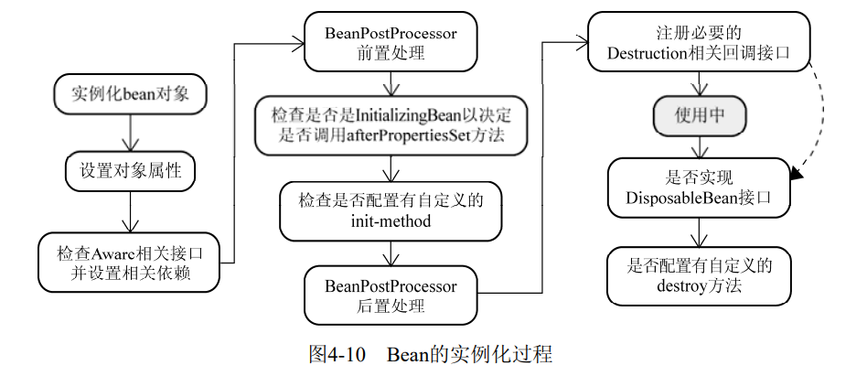

# IoC
- 控制反转
- 依赖注入
  - 构造方法注入
  - setter方法注入
  - 接口注入
### IoC如何管理对象间的依赖关系
- 直接编码
- 配置文件
- 元素据
  - 注解方式可以算作编码方式的一种特殊情况。
## IoC容器之BeanFactory
- BeanFactory：默认采用延迟初始化策略，启动速度比较快
- ApplicationContext：直接初始化所有的Bean，启动慢
### BeanFactory的对象注册与依赖绑定方式
- 直接编码方式
- 外部配置文件方式
- 注解方式
  - @Autowired
  - @Component
### 工厂方法与 FactoryBean
- 静态工厂
- 动态工厂
- factoryBean
```
public interface FactoryBean {
    Object getObject() throws Exception; 
    Class getObjectType(); 
    boolean isSingleton(); 
}
```
### 偷梁换柱之术
- 方法注入
```
<bean id="newsBean" class="..domain.FXNewsBean" singleton="false"> 
</bean> 
<bean id="mockPersister" class="..impl.MockNewsPersister"> 
<lookup-method name="getNewsBean" bean="newsBean"/> 
</bean>
```
- 殊途同归
  - 使用BeanFactoryAware接口
    - Spring框架提供了一个BeanFactoryAware接口，容器在实例化实现了该接口的bean定义的过程中，会自动将容器本身注入该bean。这样，该bean就持有了它所处的BeanFactory的引用。
  - 使用ObjectFactoryCreatingFactoryBean
    - ObjectFactoryCreatingFactoryBean 实现了BeanFactoryAware接口，它返回的ObjectFactory实例只是特定于与Spring容器进行交互的一个实现而已。使用它的好处就是，隔离了客户端对象对BeanFactory的直接引用。
  - 方法替换
## 容器背后的秘密
### 容器启动阶段
- 首先会通过某种途径加载Configuration MetaData，并且使用工具类对Configuration MetaData解析和分析。
- 并将分析后的信息编组为相应的BeanDefinition。
- 最后把这些保存了bean定义必要信息的BeanDefinition，注册到相应的BeanDefinitionRegistry，这样容器启动工作就完成了。
### Bean实例化阶段
- 当某个请求方通过容器的getBean方法明确地请求某个对象，或者因依赖关系容器需要隐式地调用getBean方法时就会启动Bean的实例化阶段。
- 容器会首先检查所请求的对象之前是否已经初始化。如果没有，则会根据注册的BeanDefinition所提供的信息实例化被请求对象，并为其注入依赖。
### 插手“容器的启动”
- Property**Placeholder**Configurer和Property**Override**Configurer是两个比较常用的BeanFactoryPostProcessor。
- PropertyPlaceholderConfigurer允许我们**在XML配置文件中使用占位符**（PlaceHolder），并将这些占位符所代表的资源单独配置到简单的properties文件中来加载。
  - 当BeanFactory在第一阶段加载完成所有配置信息时，BeanFactory中保存的对象的属性信息还只是以占位符的形式存在，如${jdbc.url}、${jdbc.driver}。当PropertyPlaceholderConfigurer作为BeanFactoryPostProcessor被应用时，它会使用properties配置文件中的配置信息来替换相应BeanDefinition中占位符所表示的属性值。
- 可以通过PropertyOverrideConfigurer对容器中配置的任何你想处理的bean定义的property信息进行覆盖替换。
- CustomEditorConfigurer是另一种类型的BeanFactoryPostProcessor实现，它只是辅助性地将后期会用到的信息注册到容器，对BeanDefinition没有做任何变动。
### 了解Bean的一生

### Bean的实例化与BeanWrapper
容器在内部实现的时候，采用“策略模式（Strategy Pattern）”来决定采用何种方式初始化bean实例。通常，可以通过反射或者CGLIB动态字节码生成来初始化相应的bean实例或者动态生成其子类。
#### 各色的Aware接口
- BeanNameAware:会将该对象实例的bean定义对应的beanName设置到当前对象实例
- BeanClassLoaderAware:会将对应加载当前bean的Classloader注入当前对象实例。
- BeanFactoryAware:BeanFactory容器会将自身设置到当前对象实例

BeanPostProcessor是存在于对象实例化阶段，而BeanFactoryPostProcessor则是存在于容器启动阶段，这两个概念就比较容易区分了。
- BeanPostProcessor
  - postProcessBeforeInitialization
  - postProcessAfterInitialization
- InitializingBean和init-method
  - InitializingBean通过实现接口来调用
  - init-method通过反射实现
- DisposableBean与destroy-method
# AOP
- JDK动态代理是实现了被代理对象的接口，Cglib是继承了被代理对象。
- JDK和Cglib都是在运行期生成字节码，JDK是直接写Class字节码，Cglib使用ASM框架写Class字节码，Cglib代理实现更复杂，生成代理类比JDK效率低。
- JDK调用代理方法，是通过反射机制调用，Cglib是通过FastClass机制直接调用方法，Cglib执行效率更高。