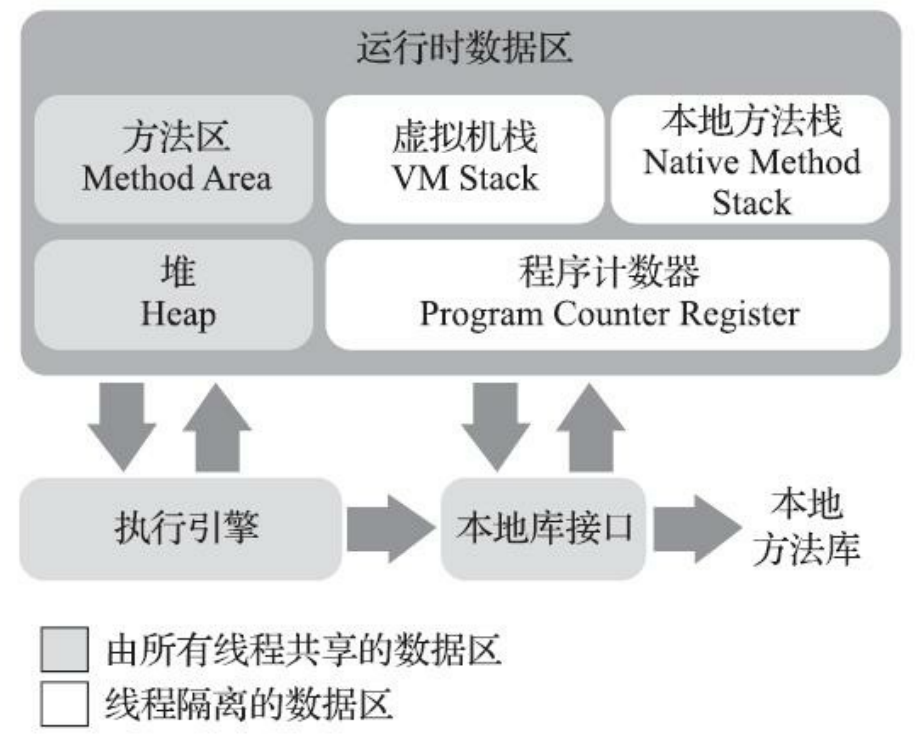

# java内存区域
## 运行时数据区

## 程序计数器
当前线程所执行的字节码的行号指示器。

于Java虚拟机的多线程是通过线程轮流切换、分配处理器执行时间的方式来实现的，在任何一个确定的时刻，一个处理器（对于多核处理器来说是一个内核）都只会执行一条线程中的指令。因此，为了线程切换后能恢复到正确的执行位置，每条线程都需要有一个独立的程序计数器，各条线程之间计数器互不影响，独立存储，我们称这类内存区域为“线程私有”的内存。

如果线程正在执行的是一个Java方法，这个计数器记录的是正在执行的虚拟机字节码指令的地址；如果正在执行的是本地（Native）方法，这个计数器值则应为空（Undefined）。
## Java虚拟机栈
与程序计数器一样，Java虚拟机栈（Java Virtual Machine Stack）也是线程私有的，它的生命周期与线程相同。虚拟机栈描述的是Java方法执行的线程内存模型：每个方法被执行的时候，Java虚拟机都会同步创建一个栈帧[1]（Stack Frame）用于存储**局部变量表、操作数栈、动态连接、方法出口**等信息。每一个方法被调用直至执行完毕的过程，就对应着一个栈帧在虚拟机栈中从入栈到出栈的过程。
## 本地方法栈
本地方法栈（Native Method Stacks）与虚拟机栈所发挥的作用是非常相似的，其区别只是虚拟机栈为虚拟机执行Java方法（也就是字节码）服务，而本地方法栈则是为虚拟机使用到的本地（Native）方法服务。
## java堆
Java世界里“几乎”所有的对象实例都在这里分配内存。
### 逃逸分析、标量替换、栈上分配
#### 逃逸分析
逃逸分析的基本行为就是分析对象的动态作用域：当一个对象在方法中被定义后，它可能被外部方法所引用，例如作为调用参数传递到其它方法中，称为方法逃逸。甚至还有可能被外部线程访问到，例如赋值给类变量或可以在其他线程中访问的实例变量，称为线程逃逸。简单的说，逃逸分析指的是分析变量能不能逃出它的作用域。
#### 一个对象主要有三种逃逸状态标记：
- 第一态：全局级别逃逸，它表示一个对象可能从一个方法或者对象里面逃逸。也就是说，其他的方法或者其他的线程也能够访问到这个对象。那么主要有以下几种场景，第一，对象作为方法的返回值返回。第二，对象作为静态字段（static field）的或者成员变量（field）。可以对应到我们前面说到的全局变量赋值逃逸和方法返回值逃逸两种场景。第三，如果重写了某一个类的 finalize 方法，那么这个类的变量都会被标记为全局逃逸状态，并且一定会放在堆内存里面。
- 第二：参数级别逃逸，如果一个对象作为参数传给一个方法，但是处这个方法以外，其他的方法不能访问这个对象，其他的线程也不能访问这个对象。那么就说明是参数级别逃逸，像我们前面介绍的实力引用传递就是参数级别逃逸。
- 第三：：无逃逸状态，指的是一个对象不会逃逸。
#### 标量替换
如果逃逸分析证明一个对象不会被外部访问，并且这个对象可以被拆散的话，那程序真正执行的时候将可能不创建这个对象，而改为直接创建它的若干个被这个方法使用到的成员变景来代替。将对象拆分后，除了可以让对象的成员变量在栈上
#### 栈上分配
如果经过逃逸分析后发现，一个对象并没有逃逸出方法的话，那么就可能被优化成栈上分配,这样就无需在堆上分配内存，也无须进行垃圾回收了。
## 方法区
方法区（Method Area）与Java堆一样，是各个线程共享的内存区域，它用于存储已被虚拟机加载的**类型信息**、**常量**、**静态变量**、**即时编译器编译后的代码缓存**等数据。
这区域的内存回收目标主要是针对常量池的回收和对类型的卸载。
### 运行时常量池
运行时常量池（Runtime Constant Pool）是方法区的一部分。Class文件中除了有类的版本、字段、方法、接口等描述信息外，还有一项信息是常量池表（Constant Pool Table），用于存放编译期生成的各种字面量与符号引用，这部分内容将在类加载后存放到方法区的运行时常量池中。
## 直接内存
在JDK 1.4中新加入了NIO（New Input/Output）类，引入了一种基于通道（Channel）与缓冲区（Buffer）的I/O方式，它可以使用Native函数库直接分配堆外内存，然后通过一个存储在Java堆里面的DirectByteBuffer对象作为这块内存的引用进行操作。这样能在一些场景中显著提高性能，因为避免了在Java堆和Native堆中来回复制数据。
