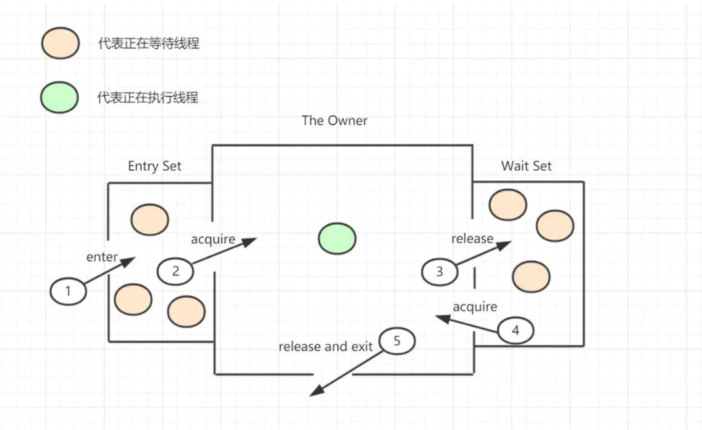
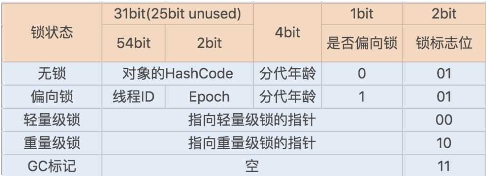

# Synchronized锁
## 锁的底层类别
|锁状态|存储内容|存储内容|
|--|--|--|
|无锁|对象hashcode、分代年龄、是否偏向|01|
|偏向锁|偏向线程、偏向时间戳、分代年龄、是否偏向|01|
|轻量级锁|指向栈中锁记录的指针|00|
|重量级锁|指向互斥量（重量级锁）的指针|10|
## Synchronized修饰方法
syncMethod 方法的 flag 包含 ACC_SYNCHRONIZED 标志位。
当调用设置了 ACC_SYNCHRONIZED 标志位的方法时，调用线程会获取 monitor，调用方法本身，再退出 monitor。
## Synchronized修饰代码块
syncCode 方法中包含 monitorenter 和 monitorexit 两个 JVM 指令。
## 工作原理

当多个线程同时访问一段同步代码时，多个线程会先被存放在 EntryList 集合中，处于 block 状态的线程，都会被加入到该 列表。接下来当线程获取到对象的 Monitor时，Monitor 是依靠底层操作系统的 Mutex Lock 来实现互斥的，线程申请 Mutex 成功，则持有该 Mutex，其它线程将无法获取到该 Mutex。
如果线程调用 wait() 方法，就会释放当前持有的 Mutex，并且该线程会进入 WaitSet 集合中，等待下一次被唤醒。如果当前线程顺利执行完方法，也将释放 Mutex。

Monitor 依赖于底层操作系统的实现，存在用户态和内核态的转换，所以增加了性能开销。但是程序中使用了 Synchronized 关键字，程序也不全会使用 Monitor，因为 JVM 对 Synchronized 的实现也有 3 种：偏向锁、轻量级锁、重量级锁。
## 锁升级
### java对象头
那么 Java 对象头又是什么？在 JDK 1.6 中，对象实例分为：
- 对象头 
  - Mark Word
  - 指向类的指针
  - 数组长度
- 实例数据
- 对齐填充

其中 Mark Word 记录了对象和锁有关的信息，在 64 位 JVM 中的长度是 64 位，具体信息如下图所示：

## 偏向锁
为什么要有偏向锁呢？偏向锁主要用来优化同一线程多次申请同一个锁的竞争。可能大部分时间一个锁都是被一个线程持有和竞争。假如一个锁被线程 A 持有，后释放；接下来又被线程 A 持有、释放……如果使用 monitor，则每次都会发生用户态和内核态的切换，性能低下。

作用：当一个线程再次访问这个同步代码或方法时，该线程只需去对象头的 Mark Word 判断是否有偏向锁指向它的 ID，无需再进入 Monitor 去竞争对象了。当对象被当做同步锁并有一个线程抢到了锁时，锁标志位还是 01，“是否偏向锁”标志位设置为 1，并且记录抢到锁的线程 ID，表示进入偏向锁状态。
## 轻量级锁
如果另一线程竞争锁，由于这个锁已经是偏向锁，则判断对象头的 Mark Word 的线程 ID 不是自己的线程 ID，就会进行 CAS 操作获取锁：
- 成功，直接替换 Mark Word 中的线程 ID 为当前线程 ID，该锁会保持偏向锁。
- 失败，标识锁有竞争，偏向锁会升级为轻量级锁。

轻量级锁的适用范围：线程交替执行同步块，大部分锁在整个同步周期内部存在场馆时间的竞争。
## 自旋锁与重量级锁
轻量级锁的 CAS 抢锁失败，线程会挂起阻塞。若正在持有锁的线程在很短的时间内释放锁，那么刚刚进入阻塞状态的线程又要重新申请锁资源。

如果线程持有锁的时间不长，则未获取到锁的线程可以不断尝试获取锁，避免线程被挂起阻塞。JDK 1.7 开始，自旋锁默认开启，自旋次数又 JVM 配置决定。

自旋锁重试之后如果抢锁依然失败，同步锁就会升级至重量级锁，锁标志位改为 10。在这个状态下，未抢到锁的线程都会进入 Monitor，之后会被阻塞在 _WaitSet 队列中。