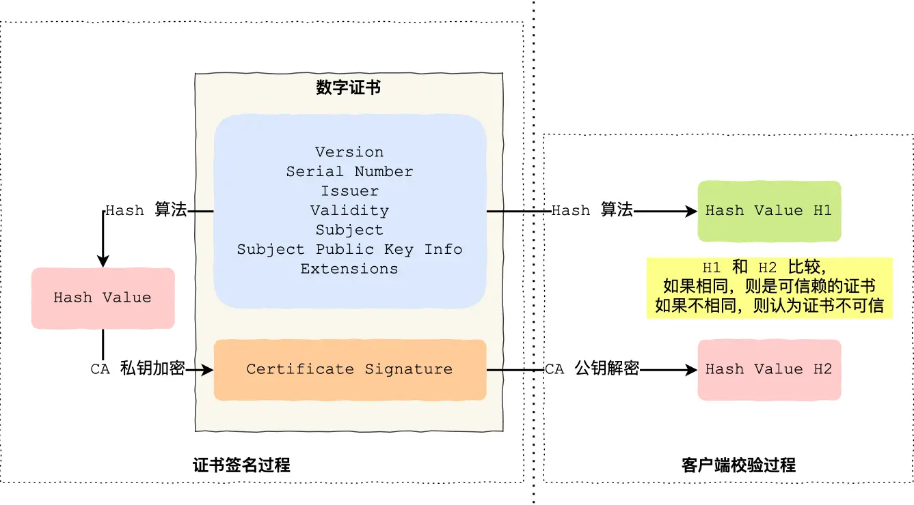

# HTTP请求和响应报文格式

## 一、HTTP请求报文格式

```
<请求方法> <请求URL> <HTTP版本>
<请求头部>
<空行>
<请求体>
```

**示例：**
```
GET /index.html HTTP/1.1
Host: www.example.com
User-Agent: Mozilla/5.0

```

## 二、HTTP响应报文格式

```
<HTTP版本> <状态码> <状态描述>
<响应头部>
<空行>
<响应体>
```

**示例：**
```
HTTP/1.1 200 OK
Content-Type: text/html; charset=UTF-8
Content-Length: 138

<html>
    <body>
        Hello, world!
    </body>
</html>
```
## 三、HTTP常见状态码表

| 状态码 | 描述                  | 说明                             |
| ------ | --------------------- | -------------------------------- |
| 200    | OK                    | 请求**成功**                     |
| 301    | Moved Permanently     | 资源永久**重定向**               |
| 302    | Found                 | 资源临时**重定向**               |
| 400    | Bad Request           | 请求有语法错误（**客户端错误**） |
| 401    | Unauthorized          | 需要身份验证（**客户端错误**）   |
| 403    | Forbidden             | 服务器拒绝请求（**客户端错误**） |
| 404    | Not Found             | 请求资源不存在（**客户端错误**） |
| 500    | Internal Server Error | 服务器内部错误（**服务器错误**） |
| 502    | Bad Gateway           | 网关错误（**服务器错误**）       |
| 503    | Service Unavailable   | 服务不可用（**服务器错误**）     |
## 四、常用请求头和响应头字段

| 字段名             | 类型        | 说明                                        |
| ------------------ | ----------- | ------------------------------------------- |
| **Host**           | 请求头      | 指定请求的目标主机                          |
| User-Agent         | 请求头      | 标识客户端软件信息                          |
| Accept             | 请求头      | 指定客户端可接受的响应内容类型              |
| Content-Type       | 请求/响应头 | 指定消息体的数据类型（如 application/json） |
| **Content-Length** | 请求/响应头 | 消息体的长度（字节数）                      |
| Cookie             | 请求头      | 客户端发送的 Cookie 信息                    |
| Set-Cookie         | 响应头      | 服务器设置 Cookie 到客户端                  |
| **Cache-Control**  | 请求/响应头 | 控制缓存行为                                |
| Authorization      | 请求头      | 提供认证信息（如令牌）                      |
| Location           | 响应头      | 重定向时指定新的 URL                        |
| Server             | 响应头      | 标识服务器软件信息                          |
| Date               | 响应头      | 响应生成的时间                              |
| **Connection**     | 请求/响应   | Http长连接                                  |
### Content-Length
> http通过设置回车符、换行符作为http header的边界，通过`Content-Length`作为http body的边界，这两个方式都是为了解决**粘包**的问题

### Connection
- 在 HTTP/1.0 时代，默认情况下，每发送一个请求，建立一个 TCP 连接，长连接机制可以使多个请求复用一个TCP连接
- 在超出空闲超时时间后或者超出最大请求数服务器会主动关闭连接
- TCP Keep-Alive保活机制如果保活失败tcp会断开连接（默认情况下，这个机制通常是关闭的，或者其超时时间非常长（例如，Linux 上默认可能是 2 小时！））
  
## 五、GET与POST的区别

| 特点         | GET                          | POST                               |
| ------------ | ---------------------------- | ---------------------------------- |
| 参数位置     | URL（查询字符串）            | 请求体                             |
| 数据长度限制 | 有限制（受URL长度影响）      | 理论上无限制（受服务器配置影响）   |
| 安全性       | 参数暴露在URL中，安全性较低  | 参数在请求体中，安全性较高         |
| 缓存         | 浏览器和代理服务器可缓存     | 一般不会被缓存                     |
| 用途         | 获取数据，不应修改服务器资源 | 提交数据，通常用于修改服务器资源   |
| 幂等性       | 幂等（多次请求结果一致）     | 非幂等（多次请求可能产生不同结果） |

**总结：**  
- 从语义上来讲：get用来获取服务器上的指定资源、post用来请求对指定资源做出处理
- 从安全和幂等来讲：get是安全幂等的、post既不安全也不幂等
GET适合用于获取数据，参数通过URL传递；POST适合提交数据，参数通过请求体传递，安全性和数据量更高。

## 六、HTTP缓存技术简介

HTTP缓存用于减少服务器负载、加快页面加载速度和节省带宽。缓存分为**强制缓存**和**协商缓存**两种方式：

### 1. 强制缓存（Expires/Cache-Control）

- **Expires**：指定资源过期时间（绝对时间），过期前直接使用本地缓存。
- **Cache-Control**：更灵活的缓存控制，如 `max-age`（秒为单位的有效期）、`no-cache`（需协商验证）、`no-store`（不缓存）。

示例：
```
Cache-Control: max-age=3600
Expires: Wed, 21 Oct 2025 07:28:00 GMT
```

### 2. 协商缓存（Last-Modified/ETag）

- **Last-Modified/If-Modified-Since**：资源最后修改时间，客户端请求时带上，服务器判断是否有更新。
- **ETag/If-None-Match**：资源内容的唯一标识，内容变化则ETag变化，客户端请求时带上，服务器判断是否有更新。

示例：
```
ETag: "abc123"
Last-Modified: Tue, 20 Jun 2023 10:00:00 GMT
```

### 3. 缓存流程简述

1. 首次请求资源，服务器返回缓存相关头部。
2. 后续请求，浏览器根据缓存策略决定是否直接使用本地缓存或向服务器发起协商请求。
3. 协商缓存命中时，服务器返回 `304 Not Modified`，客户端使用本地缓存。

### 4. 常见缓存头部字段

| 字段名           | 说明                                 |
| ---------------- | ------------------------------------ |
| Cache-Control    | 缓存策略（如 max-age, no-cache，public）(优先级高于Expires)     |
| Expires          | 资源过期时间                         |
| ETag             | 资源内容唯一标识（优先级高于Last-Modified）                     |
| Last-Modified    | 资源最后修改时间                     |
| If-None-Match    | 客户端携带的ETag用于协商缓存         |
| If-Modified-Since| 客户端携带的最后修改时间用于协商缓存 |

**总结：**  
合理利用HTTP缓存可以显著提升网站性能和用户体验，建议根据资源类型和业务需求灵活配置缓存策略。
## 七、HTTPS认证过程简介

HTTPS（HTTP Secure）通过SSL/TLS协议为HTTP通信提供加密和认证，保障数据安全。其认证过程主要包括以下步骤：

1. **客户端发起HTTPS请求**  
    浏览器向服务器发起HTTPS连接请求。

2. **服务器返回证书**  
    服务器将SSL证书（包含公钥等信息）发送给客户端。

3. **客户端验证证书**  
    客户端校验证书是否合法（由受信任CA签发、未过期、域名匹配等）。

4. **协商加密算法和生成会话密钥**  
    双方协商加密算法，客户端生成随机数并用服务器公钥加密后发送给服务器，服务器用私钥解密，双方据此生成会话密钥。

5. **建立加密通信**  
    后续HTTP数据通过会话密钥加密传输，确保数据机密性和完整性。

**流程图简述：**
```
客户端 ——> 服务器：请求HTTPS连接
服务器 ——> 客户端：返回SSL证书
客户端 ——> 服务器：验证证书，协商密钥
双方 ——> 建立加密通道，传输数据
```

**总结：**  
HTTPS通过证书认证和加密机制，有效防止数据窃取和篡改，建议所有敏感数据传输场景使用HTTPS。

**如何避免被中间人抓数据？**
1. 保证电脑安全不要被病毒侵入、不要点击任何证书违法的网站
2. 还可以通过**双向认证**来避免这个问题
   
**数字证书认证过程**


## 八、为什么有HTTP还需要RPC？

- TCP是能够收发数据，但是它是一个无边界的流式协议，应用层需要自己定义数据的边界和格式。HTTP和各类RPC框架都是在TCP之上实现的应用层协议。
- RPC本质上不是一种协议，而是一种**调用方式**，它可以基于多种传输协议（如HTTP、TCP等）实现远程过程调用。
- 从发展历史来讲，HTTP主要用于B/S架构的Web应用，RPC更多用于C/S架构，但现在分得没那么清楚了，B/S与C/S在慢慢融合。现在RPC更多用于分布式系统和微服务架构中的服务间通信。
- RPC定制化程度更高，序列化和传输效率更高，适合高性能场景，而HTTP更通用，适合跨平台和跨语言的通信。

**总结：**  
HTTP适合开放API和跨语言通信，RPC更适合服务间高效、类型安全的内部调用。实际项目中常常结合使用，根据需求选择合适的通信方式。

## 九、为什么有HTTP还需要WebSocket？

- **HTTP是单向、无状态的请求-响应协议**，每次通信都需要客户端主动发起请求，服务器被动响应，无法实现服务器主动推送数据。在如果需要实时更新数据的场景下，HTTP只能轮询、或长轮询效率较低且延迟较高。
- **WebSocket是一种双向、持久连接协议**，允许客户端和服务器之间实时、双向地交换数据，适合需要低延迟和实时交互的场景（如聊天、在线游戏、实时通知等）。
- WebSocket连接建立后，数据传输无需每次都携带完整的HTTP头部，通信开销更小，效率更高。
- HTTP适合传统的网页浏览和API调用，WebSocket适合需要持续、实时数据流的应用。

**总结：**  
WebSocket补充了HTTP在实时性和双向通信方面的不足，是现代Web应用实现高效实时交互的重要技术。