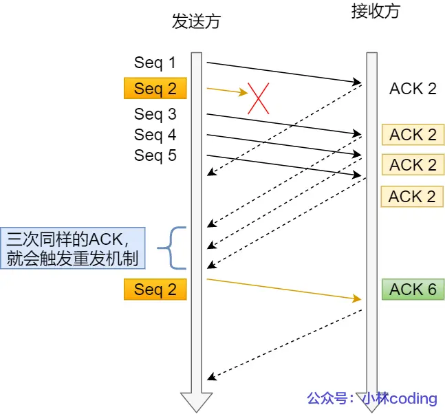
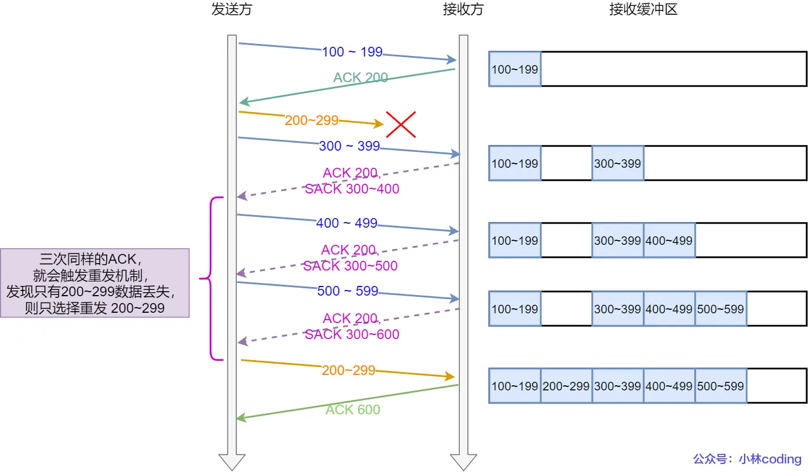
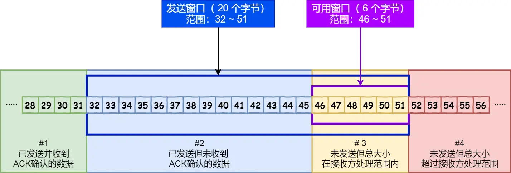
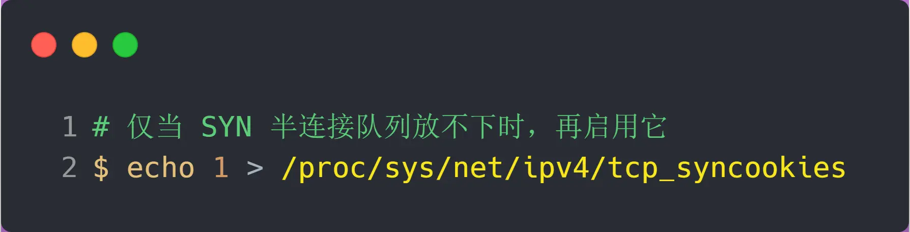

# tcp三次握手与四次挥手

## TCP的特点

### 1. 面向连接

TCP在通信前需要建立连接（三次握手），通信结束后释放连接（四次挥手）。只有建立连接后，双方才能进行数据传输，保证数据的有序和可靠。

### 2. 可靠性

TCP通过**序号、确认应答、重传机制、校验和、流量控制和拥塞控制**等手段，确保数据在传输过程中不丢失、不重复、无差错，并且按顺序到达。

### 3. 字节流

TCP以字节流的方式传输数据，应用层的数据被TCP看作一连串的字节，**没有边界**。TCP会根据实际情况将字节流分割成合适的报文段进行传输，接收方再按序重组为字节流交给应用层。

## TCP与UDP的区别

| 特点     | TCP                      | UDP                                        |
| -------- | ------------------------ | ------------------------------------------ |
| 是否连接 | 面向连接（三次握手）     | 无连接                                     |
| 可靠性   | 可靠，保证数据完整、顺序 | 不可靠，可能丢包、乱序、重复               |
| 传输方式 | 字节流                   | 数据报（接收方收到发送方一个完整的数据报） |
| 速度     | 较慢（有流控、拥塞控制） | 较快（无流控、拥塞控制）                   |
| 应用场景 | 文件传输、网页、邮件等   | 视频、语音、DNS等                          |

TCP适用于对数据可靠性要求高的场景，UDP适用于对实时性要求高但可容忍丢包的场景。

### TCP三次握手的过程

#### 为什么是三次握手，不是两次四次

一句话概括就是确保双方都拥有数据的收发能力。
**原因一**：避免历史连接
如果两次握手就建立连接，那么在网络阻塞的情况下，旧的syn包先到达服务端，历史的连接就被建立了，这意味着服务器可能会在一个无效的连接上发送数据。

**原因二**：同步双方初始序列号
一来一回的的三次握手过程，才能确保双方的序列号被正确同步。
**总结**

- 两次握手：无法防止历史连接的建立，会造成双方资源的浪费，也无法可靠同步双方的序列号。
- 四次握手：三次握手就已经理论上建立可靠连接了，第四次握手没有意义，反而增加了延迟。

### 为什么建立TCP连接时，初始化的序列号是随机的

- 安全：防止测序攻击，
- 历史报文被接收：防止旧的报文被下一个相同四元组的连接错误地接收（有回绕问题，不是完全避免）
序列号ISN随机生成算法，ISN = M + R，其中M是一个全局递增的计数器，R是一个随机数。

### 既然IP层会分片，为什么TCP还要MSS呢

TCP的MSS（最大报文段长度）是为了避免IP层分片带来的性能问题。

如果TCP发送的报文段超过了网络层（IP）的MTU（最大传输单元），就会在IP层进行分片，当一个ip分片丢失，整个报文都要重传增加了额外的开销和延迟。

### 第一次握手丢失会发生什么

如果第一次握手的SYN包丢失，客户端会在超时时间后重传SYN包，直到收到服务器的SYN-ACK响应或达到重传次数上限。如果达到上限仍未收到响应，客户端会放弃连接尝试并报告错误。

### 第二次握手丢失会发生什么

如果第二次握手的SYN-ACK包丢失，客户端会在超时时间后重传SYN包，服务器会重新发送SYN-ACK包，直到达到重传次数上限。如果达到上限仍未收到响应，客户端会放弃连接尝试并报告错误。

### 第三次握手丢失会发生什么

如果第三次握手的ACK包丢失，由于ACK不会重传，所以服务器会在超时时间后重传SYN-ACK包，客户端会重新发送ACK包，直到达到重传次数上限。如果达到上限仍未收到响应，双方都会放弃连接尝试并报告错误。

### 什么是SYN攻击，如何避免

SYN攻击是一种常见的拒绝服务攻击（DoS），攻击者向目标服务器发送大量的SYN请求，但不完成握手过程，如果SYN队列满了，就不能提供服务了，导致服务器资源被耗尽，无法处理正常的请求。

#### 如何避免SYN攻击

1. **SYN Cookies**：在服务器端使用SYN Cookies 技术，避免为每个SYN请求分配资源，只有在完成握手后才分配。

2. **防火墙**：使用防火墙过滤异常的SYN请求，识别并阻止可疑的IP地址。

## TCP连接断开

### 为什么挥手需要四次？

关闭连接时，客户端向服务端发送FIN时，仅仅表示客户端不在发送数据了但是还能接收数据。服务端收到客户端发送的FIN报文时，先回答一个ACK应答，而服务端还可能有数据需要处理和发送，等服务端不在发送数据时，才发送FIN报文给客户端，表示同意现在关闭连接。

### 第一次挥手丢失了会发生什么

如果第一次挥手的FIN包丢失，客户端会在超时时间后重传FIN包，直到收到服务器的ACK响应或达到重传次数上限。如果达到上限仍未收到响应，客户端会放弃连接尝试并报告错误。

### 第二次挥手丢失了会发生什么

如果第二次挥手的ACK包丢失，客户端会在超时时间后重传FIN包，服务器会重新发送ACK包，直到达到重传次数上限。如果达到上限仍未收到响应，客户端会放弃连接尝试并报告错误。

### 第三次挥手丢失了会发生什么

如果第三次挥手的ACK包丢失，客户端会在超时时间后重传FIN包，服务器会重新发送ACK包，直到达到重传次数上限。如果达到上限仍未收到响应，客户端会放弃连接尝试并报告错误。

对于close函数关闭的连接，由于无法发送和接收数据，所以FIN_WAIT_2状态不可持续太久，而tcp_fin_timeout控制了这个连接状态下的时长，默认是60s

但是值得注意的是，如果主动关闭方使用shutdown函数关闭连接，那么FIN_WAIT_2状态的持续时间可能会更长，因为shutdown函数允许在关闭连接之前先发送和接收数据。

### 第四次挥手丢失会发生什么

如果第四次挥手的ACK包丢失，服务器会在超时时间后重传FIN包，客户端会重新发送ACK包，直到达到重传次数上限。如果达到上限仍未收到响应，服务器会放弃连接尝试并报告错误。如果客户端超2MSL未收到服务器的ACK包，客户端会主动关闭连接。

### 为什么TIME_WAIT状态要持续2MSL

- 确保最后一个ACK包能被对方收到：如果被动方没有收到断开连接最后的ACK报文，就会触发超时重发FIN报文，另一方接收到后会重新发送ACK报文。这一来一回正好2MSL。

- 防止旧的重复连接请求被误处理：为了防止历史连接中的数据，被后面想通过的四元组的连接错误的接收，因此TCP设计了TIME_WAIT状态，状态持续时间为2MSL。这个时间足以让两个方向上的数据数据包都被丢弃，使得原来的连接的数据包在网络中丢弃

### TIME_WAIT过多有什么危害

- 资源系统占用：每个处于TIME_WAIT状态的连接都会占用系统的资源，包括内存和文件描述符等。如果TIME_WAIT状态过多，可能会导致系统资源耗尽，影响正常的连接请求。
- 占用端口：TIME_WAIT状态的连接会占用本地端口，导致无法立即重用这些端口，影响新连接的建立。
**对客户端来讲**：TIME_WAIT过多，占满了所有端口的资源，那么就无法对**目的IP和目的PORT**都一样的服务发起连接。
**对服务端来讲**：TIME_WAIT过多，并不会导致端口资源受限，因为服务只监听一个端口，理论上服务端可以建立很多个连接。但是TCP连接太多回导致系统资源占用，例如，文件描述符、内存资源、CPU资源和线程资源等。

### 如何优化TIME_WAIT

- **方式一：net.ipv4.tcp_tw_reuse 和 tcp_timestamps**，这两个Linux内核参数打开后，则可以复用TIME_WAIT状态的连接端口，从而减少TIME_WAIT状态的连接数量。
- **方式二：net.ipv4.tcp_max_tw_buckets**，该参数用于限制TIME_WAIT状态的连接数量，一旦超过限制，就会主动关闭最旧的TIME_WAIT连接。
- **方式三：设置socket的close行为**，可以直接跳过三次握手直接给关闭。

### 服务器出现大量 TIME_WAIT 状态的原因有哪些？

- 短连接：服务器处理大量短连接，连接频繁建立和关闭，导致TIME_WAIT状态增多。
- 长连接超时：应用层（nginx）一般会设置一个超时时间，如果服务器在这个时间内没有收到数据，就会主动关闭连接，导致TIME_WAIT状态增多。
- 长连接请求数量达到上限：应用层一般会设置单个http连接的最大请求数量，当请求数量超过这个数服务器就会断开连接，在高QPS的情况下，会导致处于TIME_WAIT状态增加。

### 服务器出现大量 CLOSE_WAIT 状态的原因有哪些？

1. 创建服务端 socket，bind 绑定端口、listen 监听端口
2. 将服务端 socket 注册到 epoll
3. epoll_wait 等待连接到来，连接到来时，调用 accpet 获取已连接的 socket
4. 将已连接的 socket 注册到 epoll
5. epoll_wait 等待事件发生
6. 对方连接关闭时，我方调用 close
在这个过程中，某个地方出问题了，导致服务器没有调用close关闭连接，导致大量CLOSE_WAIT状态。

### 如果已经建立了连接，但是客户端突然出现故障了怎么办

TCP有**保活机制**，可以定期发送探测包，检测对方是否仍然可用。如果探测包超时未收到响应，就会主动关闭连接。

### 如果已经建立了连接，但是服务端的进程崩溃会发生什么？

当服务端进程崩溃的时候，内核会回收该进程的所有资源，包括网络连接，于是内核会发送第一次FIN报文给客户端完成四次挥手。

## socket编程

### 针对TCP应该如何socket编程

监听的socket和已连接的socket是两个不同的socket，一个叫监听socket一个叫做已连接socket。

### accept发生在三次握手的哪一步

我们可以得知客户端connect成功返回是在第二次握手时。服务端accept返回是在第三次握手后。

### 客户端调用 close 了，连接是断开的流程是什么

服务端接收到FIN报文后，TCP协议栈会为FIN包插入一个文件结束符EOF，当服务端读到EOF时，服务器进入closed_wait状态，处理完数据就会调用close进入到last_ack状态。

### 没有 accept，能建立 TCP 连接吗？

可以的，accpet 系统调用并不参与 TCP 三次握手过程

### 服务端没有 listen，客户端发起连接建立，会发生什么

服务端如果只 bind 了 IP 地址和端口，而没有调用 listen 的话，然后客户端对服务端发起了连接建立，服务端会回 RST 报文。
服务端在没有listen的情况下，先在已连接的队列中查找是否有对应的连接请求，如果没有就会在未连接队列中查找，如果未连接队列也没有，就会发送RST报文拒绝连接。

### 没有 listen，能建立 TCP 连接吗？

可以

在 TCP 自连接的情况中，客户端在 connect 方法时，**网络层**会把syn包路由到自己，然后完成三次握手。

# TCP 重传、滑动窗口、流量控制、拥塞控制

## 重传机制

### 超时重传

超时重传的时间叫做RTO（Retransmission Timeout），RTO的计算基于RTT（Round Trip Time，往返时间）的估计。常用的算法是Jacobson/Karels算法，通过测量RTT的变化来动态调整RTO。

- 当超时时间 RTO 较大时，重发就慢，丢了老半天才重发，没有效率，性能差
- 当超时时间 RTO 较小时，重发就快，可能会导致重复数据包的产生，增加网络负担。

### 快速重传

发送端收到了三个 Ack = 2 的确认，知道了 Seq2 还没有收到，就会在定时器过期之前，重传丢失的 Seq2。

快速重传机制只解决了一个问题，就是超时时间的问题，但是它依然面临着另外一个问题。就是重传的时候，是重传一个，还是重传所有的问题。

### SACK 方法

这种方式需要在 TCP 头部「选项」字段里加一个 SACK 的东西，它可以将已收到的数据的信息发送给「发送方」，这样发送方就可以知道哪些数据收到了，哪些数据没收到，知道了这些信息，就可以只重传丢失的数据。

### Duplicate SACK

**ACK包丢失**

**网络延时**

可见Duplicate SACK的好处是

- 可以让「发送方」知道，是发出去的包丢了，还是接收方回应的 ACK 包丢了;
- 可以知道是不是「发送方」的数据包被网络延迟了;

## 滑动窗口

这个字段是接收端告诉发送端自己还有多少缓冲区可以接收数据。于是发送端就可以根据这个接收端的处理能力来发送数据，而不会导致接收端处理不过来。
**发送端窗口**

**接收端窗口**

> 接收窗口和发送窗口的大小是相等的吗？

并不是完全相等，接收窗口的大小是约等于发送窗口的大小的。
**流量控制**

**窗口关闭**

TCP 为每个连接设有一个持续定时器，只要 TCP 连接一方收到对方的零窗口通知，就启动持续计时器。如果持续计时器超时，就会发送窗口探测 ( Window probe ) 报文，而对方在确认这个探测报文时，给出自己现在的接收窗口大小。

窗口探测的次数一般为 3 次，每次大约 30-60 秒（不同的实现可能会不一样）。如果 3 次过后接收窗口还是 0 的话，有的 TCP 实现就会发 RST 报文来中断连接。
**糊涂窗口综合症**
如果接收方腾出几个字节并告诉发送方现在有几个字节的窗口，而发送方会义无反顾地发送这几个字节，这就是糊涂窗口综合症。

接收方策略：
当「窗口大小」小于 min( MSS，缓存空间/2 ) ，也就是小于 MSS 与 1/2 缓存大小中的最小值时，就会向发送方通告窗口为 0，也就阻止了发送方再发数据过来。
发送方通常的策略如下:
要等到窗口大小 >= MSS 并且 数据大小 >= MSS；并且收到之前发送数据的 ack 回包；

## 拥塞控制

拥塞控制，控制的目的就是避免「发送方」的数据填满整个网络。
拥塞窗口 cwnd是发送方维护的一个的状态变量，它会根据网络的拥塞程度动态变化的。
> 发送窗口收到拥塞窗口和滑动窗口的大小限制。

**慢启动**
慢启动的算法记住一个规则就行：当发送方每收到一个 ACK，拥塞窗口 cwnd 的大小就会加 1。

可以看出慢启动算法，**发包的个数是指数性的增长**。
> 那慢启动涨到什么时候是个头呢？

有一个叫慢启动门限 ssthresh （slow start threshold）状态变量。

- 当 cwnd < ssthresh 时，使用慢启动算法。
- 当 cwnd >= ssthresh 时，就会使用「拥塞避免算法」。

**拥塞避免算法**
前面说道，当拥塞窗口 cwnd 「超过」慢启动门限 ssthresh 就会进入拥塞避免算法。

当触发了重传机制，也就进入了「拥塞发生算法」。

## 拥塞发生

当网络出现拥塞，也就是会发生数据包重传，重传机制主要有两种：

- 超时重传
- 快速重传

**超时重传**
> 当发生了「超时重传」，则就会使用拥塞发生算法

- ssthresh 设为 cwnd/2
- cwnd 重置为 1
- 
  
**快速重传**
TCP 认为这种情况不严重，因为大部分没丢，只丢了一小部分，所以就会使用快速重传算法。

- cwnd = cwnd/2 ，也就是设置为原来的一半;
- ssthresh = cwnd
- 进入快速恢复算法

**快速恢复**

- 拥塞窗口 cwnd = ssthresh + 3 （ 3 的意思是确认有 3 个数据包被收到了）；
- 重传丢失的数据包；
- 如果再收到重复的 ACK，那么 cwnd 增加 1；
- 如果收到新数据的 ACK 后，把 cwnd 设置为第一步中的 ssthresh 的值，原因是该 ACK 确认了新的数据，说明从 duplicated ACK 时的数据都已收到，该恢复过程已经结束，可以回到恢复之前的状态了，也即再次进入拥塞避免状态；

> 首先，快速恢复是拥塞发生后慢启动的优化，其首要目的仍然是降低 cwnd 来减缓拥塞，所以必然会出现 cwnd 从大到小的改变。
> 其次，过程2（cwnd逐渐加1）的存在是为了尽快将丢失的数据包发给目标，从而解决拥塞的根本问题（三次相同的 ACK 导致的快速重传），所以这一过程中 cwnd 反而是逐渐增大的。

# TCP半连接和全连接队列

## 什么是TCP半连接和全连接队列

- 半连接队列：在TCP三次握手的过程中，处于SYN_RECV状态的连接请求会被放入半连接队列中，等待应用层的accept调用来完成连接的建立。
- 全连接队列：在TCP连接建立完成后，处于ESTABLISHED状态的连接会被放入全连接队列中，等待应用层的读写操作。

## 实战 - TCP 全连接队列溢出

> 如何知道应用程序的 TCP 全连接队列大小？

在服务端可以使用 ss 命令，来查看 TCP 全连接队列的情况：
但需要注意的是 ss 命令获取的 Recv-Q/Send-Q 在「LISTEN 状态」和「非 LISTEN 状态」所表达的含义是不同的。

> Linux 有个参数可以指定当 TCP 全连接队列满了会使用什么策略来回应客户端。

tcp_abort_on_overflow 共有两个值分别是 0 和 1，其分别表示：

- 0 ：如果全连接队列满了，那么 server 扔掉 client 发过来的 ack ；
- 1 ：如果全连接队列满了，那么 server 会主动 RST 连接。

> 如何增大 TCP 全连接队列呢？

TCP 全连接队列的最大值取决于 somaxconn 和 backlog 之间的最小值

- somaxconn 是 Linux 内核的参数，默认值是 128，可以通过 /proc/sys/net/core/somaxconn 来设置其值；
- backlog 是 listen 函数的第二个参数，用来指定 TCP 全连接队列的大小。Nginx 默认值是 511，可以通过修改配置文件设置其长度；

## 实战 - TCP 半连接队列溢出

> 如何查看 TCP 半连接队列长度？

> 半连接队列的最大长度由哪些参数决定

- 当 max_syn_backlog > min(somaxconn, backlog) 时，当 max_syn_backlog > min(somaxconn, backlog) 时;（**两倍的全连接队列大小**）
- 当 max_syn_backlog < min(somaxconn, backlog) 时，半连接队列最大值 max_qlen_log = max_syn_backlog * 2;

> 如果 SYN 半连接队列已满，只能丢弃连接吗？

开启 syncookies 功能就可以在不使用 SYN 半连接队列的情况下成功建立连接

syncookies 参数主要有以下三个值：

- 0 ：关闭 syncookies 功能
- 1 ：表示仅当 SYN 半连接队列放不下时，再启用它；
- 2 ：表示无条件开启功能

如何防御 SYN 攻击？

**方式一：增大半连接队列**
要想增大半连接队列，我们得知不能只单纯增大 tcp_max_syn_backlog 的值,还需一同增大 somaxconn 和 backlog，也就是增大全连接队列。

**方式二：开启 syncookies**

**方式三：减少 SYN+ACK 重传次数**
当服务端受到 SYN 攻击时，就会有大量处于 SYN_RECV 状态的 TCP 连接，处于这个状态的 TCP 会重传 SYN+ACK ，当重传超过次数达到上限后，就会断开连接。
那么针对 SYN 攻击的场景，我们可以减少 SYN+ACK 的重传次数，以加快处于 SYN_RECV 状态的 TCP 连接断开。
