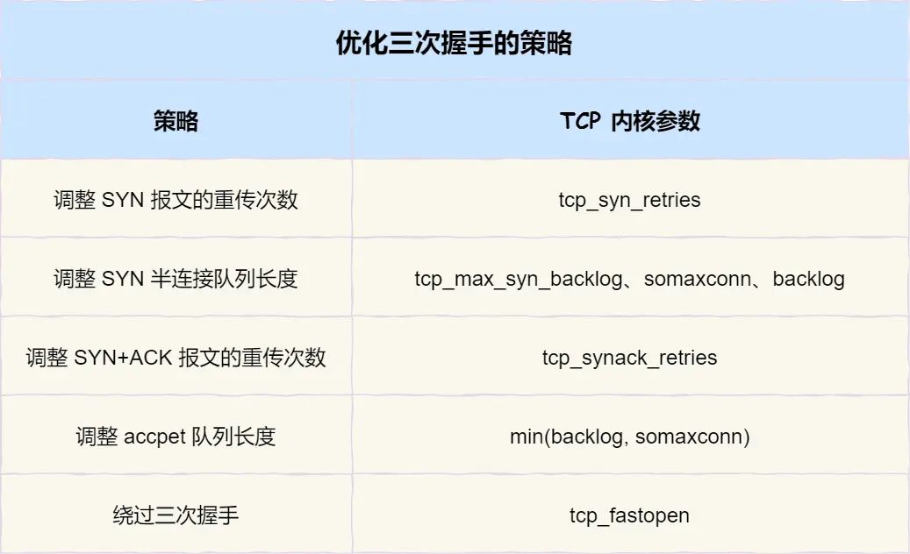

# 如何优化TCP性能

接下来，将以三个角度来阐述提升 TCP 的策略，分别是：

- TCP 三次握手的性能提升；
- TCP 四次挥手的性能提升；
- TCP 数据传输的性能提升；

## TCP三次握手的优化

### 客户端优化

三次握手建立连接的首要目的是「同步序列号」。SYN 的全称就叫 Synchronize Sequence Numbers（同步序列号）。

> SYN_SENT 状态的优化

syn包重传的次数由 tcp_syn_retries 参数控制，默认的是5次，间隔时间是1、2、4、8、16秒，总共大概31秒。可以根据网络的稳定性和目标服务器的繁忙程度修改 SYN 的重传次数。比如内网中通讯时，就可以适当调低重试次数，尽快把错误暴露给应用程序。

### 服务端优化

> 半连接队列的优化

**方式一：增大半连接队列**
要想增大半连接队列，我们得知不能只单纯增大 tcp_max_syn_backlog 的值,还需一同增大 somaxconn 和 backlog，也就是增大全连接队列。

**方式二：开启 syncookies**

**方式三：减少 SYN+ACK 重传次数**
当服务端受到 SYN 攻击时，就会有大量处于 SYN_RECV 状态的 TCP 连接，处于这个状态的 TCP 会重传 SYN+ACK ，当重传超过次数达到上限后，就会断开连接。
那么针对 SYN 攻击的场景，我们可以减少 SYN+ACK 的重传次数，以加快处于 SYN_RECV 状态的 TCP 连接断开。

> SYN_RCV 状态的优化

当客户端接收到服务器发来的 SYN+ACK 报文后，就会回复 ACK 给服务器，如果服务器没有收到 ACK，就会重发 SYN+ACK 报文，同时一直处于 SYN_RCV 状态。

当网络繁忙、不稳定时，报文丢失就会变严重，此时应该调大重发次数。反之则可以调小重发次数。修改重发次数的方法是，调整 tcp_synack_retries。tcp_synack_retries 的默认重试次数是 5 次。

> accept 队列长度的优化

由于accept队列满了之后，服务器就会丢弃客户端发来的ack或者应答rst报文，所以我们可以通过增大accept队列的长度来提升三次握手的成功率。

accept 队列的长度取决于 somaxconn 和 backlog 之间的最小值，也就是 min(somaxconn, backlog)，其中：

- somaxconn 是 Linux 内核的参数，默认值是 128，可以通过 /proc/sys/net/core/somaxconn 来设置其值；
- backlog 是 listen 函数的第二个参数，用来指定 TCP 全连接队列的大小。Nginx 默认值是 511，可以通过修改配置文件设置其长度；

### 如何绕过三次握手

在 Linux 3.7 内核版本之后，提供了 TCP Fast Open 功能，这个功能可以减少 TCP 连接建立的时延。

开启了 TFO 功能，cookie 的值是存放到 TCP option 字段里的：

### 小结

> 客户端的优化

当客户端发起 SYN 包时，可以通过 tcp_syn_retries 控制其重传的次数。

> 服务端的优化

- 当半连接队列满了时，可以增大半连接队列的长度、打开syncookie或减少SYN+ACK重传次数。
- 当网络繁忙时，可以调大 SYN+ACK 重传次数，反之则可以调小重传次数。
- 当全连接队列满了时，可以增大全连接队列的长度。
  
> 绕过三次握手

TCP Fast Open 功能可以绕过三次握手，使得 HTTP 请求减少了 1 个 RTT 的时间，Linux 下可以通过tcp_fastopen 开启该功能，同时必须保证服务端和客户端同时支持。

## TCP 四次挥手的性能提升

### 主动方的优化

关闭连接的方式通常有两种，分别是 RST 报文关闭和 FIN 报文关闭。如果进程收到 RST 报文，就直接关闭连接了，不需要走四次挥手流程，是一个暴力关闭连接的方式。

调用 close 函数和 shutdown 函数可以正常关闭连接

- 调用了 close 函数意味着完全断开连接，此时，调用了 close 函数的一方的连接叫做「孤儿连接」
- 调用 shutdown 函数可以实现优雅关闭连接，允许在关闭连接之前先发送和接收数据。（可以关闭读、可以关闭写、也可以都关闭）

> FIN_WAIT1 状态的优化

主动方发送 FIN 报文后，连接就处于 FIN_WAIT1 状态，收不到对方返回的 ACK 时，连接就会一直处于 FIN_WAIT1 状态。如果 FIN_WAIT1 状态连接很多，我们就需要**考虑降低  tcp_orphan_retries 的值**，当重传次数超过tcp_orphan_retries 时，连接就会直接关闭掉。

如果遇到恶意攻击，FIN 报文根本无法发送出去，这由 TCP 两个特性导致的：

- 首先，TCP 必须保证报文是有序发送的，FIN 报文也不例外，当发送缓冲区还有数据没有发送时，FIN 报文也不能提前发送。
- 其次，TCP 有流量控制功能，当接收方接收窗口为 0 时，发送方就不能再发送数据。( FIN 报文也不行)

解决这种问题的方法，是**调整 tcp_max_orphans 参数**，它定义了「孤儿连接」的最大数量

> FIN_WAIT2 状态的优化

> TIME_WAIT 状态的优化

Linux 提供了 tcp_max_tw_buckets 参数，当 TIME_WAIT 的连接数量超过该参数时，新关闭的连接就不再经历 TIME_WAIT 而直接关闭

有一种方式可以在建立新连接时，复用处于 TIME_WAIT 状态的连接，那就是打开 tcp_tw_reuse 参数。tcp_tw_reuse 只作用在 connect 函数，也就是客户端，跟服务端一毛关系的没有。使用这个选项，还有一个前提，需要打开对 TCP 时间戳的支持。

我们可以在程序中设置 socket 选项，来设置调用 close 关闭连接行为。如果 l_onoff 为非 0， 且 l_linger 值为 0，那么调用 close 后，会立该发送一个 RST 标志给对端，该 TCP 连接将跳过四次挥手，也就跳过了 TIME_WAIT 状态，直接关闭。(只能使用在客户端，如果服务的用了客户端就会报错)

### 被动方的优化

被动关闭的连接方应对非常简单，它在回复 ACK 后就进入了 CLOSE_WAIT 状态，等待进程调用 close 函数关闭连接。因此，出现大量 CLOSE_WAIT 状态的连接时，应当从应用程序中找问题。

## TCP 传输数据的性能提升

### 调节滑动窗口的大小

由于TCP报文窗口字段只有2字节，所以窗口最大支持65535字节大小的窗口，也就是 64KB 大小。如果网络良好，接收方的处理能力也强，那么64KB的窗口就会成为瓶颈。在 TCP 选项字段定义了窗口位移，最大可以将窗口扩大到 1GB。

### 如何确定最大传输速度？

由于发送缓冲区大小决定了发送窗口的上限，而发送窗口又决定了「已发送未确认」的飞行报文的上限。因此，发送缓冲区不能超过「带宽时延积」。

### 怎样调整缓冲区大小？

上面三个数字单位都是字节，它们分别表示：

- 第一个数值是动态范围的最小值，4096 byte = 4K；
- 第二个数值是初始默认值，16384 byte ≈ 16K；
- 第三个数值是动态范围的最大值，4194304 byte = 4096K（4M）；
发送缓冲区是自行调节的，当发送方发送的数据被确认后，并且没有新的数据要发送，就会把发送缓冲区的内存释放掉。

上面三个数字单位都是字节，它们分别表示：

- 第一个数值是动态范围的最小值，表示即使在内存压力下也可以保证的最小接收缓冲区大小，4096 byte = 4K；
- 第二个数值是初始默认值，87380 byte ≈ 86K；
- 第三个数值是动态范围的最大值，6291456 byte = 6144K（6M）；

发送缓冲区的调节功能是自动开启的，而接收缓冲区则需要配置 tcp_moderate_rcvbuf 为 1 来开启调节功能

 | 值的位置 |参数名 |含义 |行为|
 |--- |--- |--- |--- |
|第一个值 |low |压力下限 |当 TCP 使用的内存低于此值时，内核认为内存充足，不进行内存压力管理。
|第二个值 |pressure |压力阈值 |当 TCP 内存使用超过此值时，内核进入“内存压力”模式，开始更积极地回收内存。
|第三个值 |max |硬性上限 |TCP 可使用的最大内存。超过此值，新连接可能被拒绝或数据无法发送。

- 当 TCP 内存小于第 1 个值时，不需要进行自动调节；
- 在第 1 和第 2 个值之间时，内核开始调节接收缓冲区的大小;
- 大于第 3 个值时，内核不再为 TCP 分配新内存，此时新连接是无法建立的；

> 根据实际场景调节的策略

在高并发服务器中，为了兼顾网速与大量的并发连接，我们应当保证缓冲区的动态调整的最大值达到带宽时延积，而最小值保持默认的 4K 不变即可。而对于内存紧张的服务而言，调低默认值是提高并发的有效手段。

同时，如果这是网络 IO 型服务器，那么，调大 tcp_mem 的上限可以让 TCP 连接使用更多的系统内存，这有利于提升并发能力。需要注意的是，tcp_wmem 和 tcp_rmem 的单位是字节，而 tcp_mem 的单位是页面大小。而且，千万不要在 socket 上直接设置 SO_SNDBUF 或者 SO_RCVBUF，这样会关闭缓冲区的动态调整功能。

### 小结

