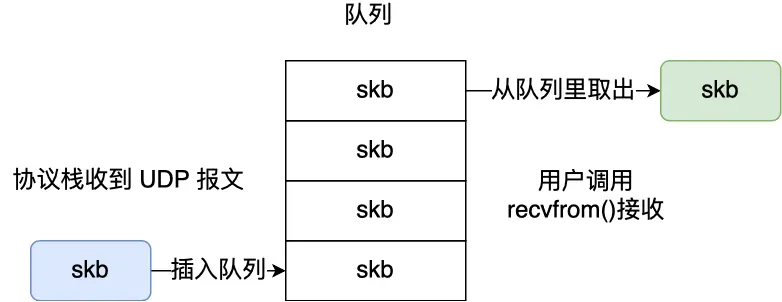

> 先来说说为什么 UDP 是面向报文的协议？

当用户消息通过 UDP 协议传输时，操作系统不会对消息进行拆分，在组装好 UDP 头部后就交给网络层来处理，所以发出去的 UDP 报文中的数据部分就是完整的用户消息，也就是每个 UDP 报文就是一个用户消息的边界，这样接收方在接收到 UDP 报文后，读一个 UDP 报文就能读取到完整的用户消息。

> 再来说说为什么 TCP 是面向字节流的协议？

当用户消息通过 TCP 协议传输时，消息可能会被操作系统分组成多个的 TCP 报文，也就是一个完整的用户消息被拆分成多个 TCP 报文进行传输。接收方在接收到 TCP 报文后，需要将多个 TCP 报文组装起来才能读取到完整的用户消息。

我们不能认为一个用户消息对应一个 TCP 报文，正因为这样，所以 TCP 是面向字节流的协议。(粘包问题交给应用层处理)

一般有三种方式分包的方式：

- 固定长度的消息（实际中很少用）
- 特殊字符作为边界（http就是用的这种）
- 自定义消息结构（rpc）